# Lab 02 - Exercise 2: Monitor and Troubleshoot Microsoft 365

> **!IMPORTANT**: `Once you launch the track, you’ll have access to a virtual machine (VM) for 40 hours. The displayed track duration of 30 days indicates the time frame during which you can use your VM. Please plan your lab sessions accordingly. If the VM uptime of 40 hours is fully exhausted before completing the labs, access will be lost. To avoid this and for detailed instructions on VM usage and stopping/deallocating the VM, refer to the Getting Started page.`

> `If the full 40 hours of VM uptime is exhausted, the VM will no longer be accessible, and the lab duration cannot be extended.`

## Lab scenario

In this exercise you will be introduced to some troubleshooting tools in Microsoft 365 that enable you to troubleshoot mail flow issues. You will then analyze Adatum’s Microsoft 365 service health by reviewing several of the key service health queries and reports that are available. You will conclude this exercise by reviewing how to submit a service request with the Microsoft Support team should you ever need assistance with a problem.

### Task 1 - Troubleshoot Mail Flow in Microsoft 365

In this task, you will investigate and resolve mail delivery issues in Microsoft 365 by using tools such as the Message Trace, Exchange admin center, and mail flow insights.

1. You should still be logged into LON-CL1 after having completed the prior exercise, and you should still be logged into Microsoft 365 as Holly Dickson.

2. In your **Microsoft Edge** browser, select the **Home | Microsoft 365** tab to display Holly's Microsoft 365 Home page, which should still be open. If not, navigate to **https://www.microsoft365.com** and log in as **Holly@otuwamocZZZZZZ.onmicrosoft.com (where ZZZZZZ is the tenant prefix provided by your lab hosting provider)**. For the password, sign-in with the same **Microsoft 365 Tenant Password**
   - Password:- <inject key="AzureAdUserPassword"></inject>

     

     

     > **Note:** For example, in **odl*user*<inject key="DeploymentID" enableCopy="false"/>@otuwamocZZZZZZ.onmicrosoft.com**, the highlighted portion (**otuwamocZZZZZZ.onmicrosoft.com**) represents the domain name or tenant prefix, which you can replace with your desired tenant prefix.

     > **Note:** If the password provided above does not work, navigate to the **Environment** tab in the lab guide and scroll down to the **Environment Information** section. There you'll find the current password for the user account required to sign in.
     >
     > 

3. In the **Microsoft 365 Copilot page** page, select **Apps (1)**, and then select **Outlook (2)**.

   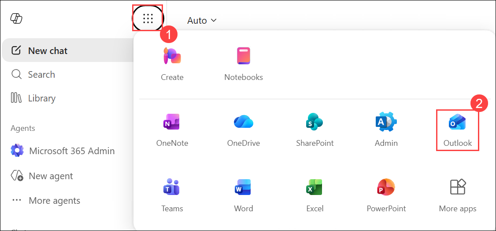

4. If you're automatically signed into Outlook using Holly's account, then proceed to the next step. However, if a **Pick an account** window appears, select Holly's account, if an **Enter password** window appears, select **Use your password instead** and enter Password:- **<inject key="AzureAdUserPassword"></inject>** and select **Sign in**.

   

   

   > **Note:** If a **Stay signed in?** window appears, select the **Don't show this again** check box and select **Yes**.

   > **Note:** If the password provided above does not work, navigate to the **Environment** tab in the lab guide and scroll down to the **Environment Information** section. There you'll find the current password for the user account required to sign in.
   >
   > 

   > **Note:** If a **Action Required** popup window appears, click **Ask Later**.

5. Holly's **Inbox** will be displayed in Outlook. If a **Welcome** window appears, select the **X** in the upper-right corner of the window to close it. In Holly’s mailbox, at the top of the navigation pane, select the **New Mail** button to create a new email.

   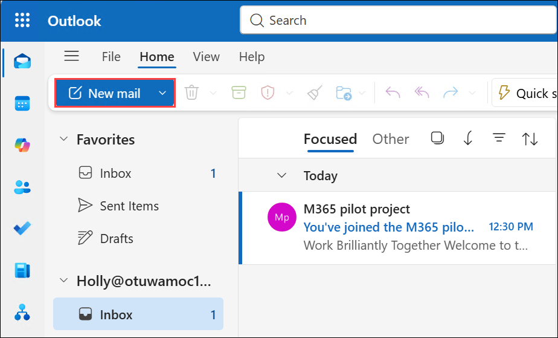

6. In this email, you will send the mail to an email address in which the domain (alt.none) is an invalid domain. In the email pane that appears, enter **user@alt.none** in the **To** field. In the drop-down menu that appears, select **Use this address: user@alt.none**.

7. Enter **Testing invalid domain** in the **Subject** field and then send the email.

8. Wait for the non-delivery report (NDR) message to appear in Holly’s Inbox, then double-click the message to open it in a new window. This will make it easier to copy the text of the message in the next step.

   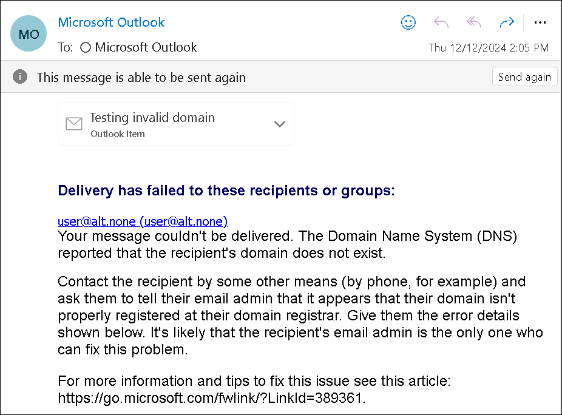

9. In the message window, scroll down through the message until you reach the body of text that says **Diagnostic information for administrators**. Select the text in the body of the message starting AFTER **Diagnostic information for administrators** through the end of the message. With this text selected, press **Ctrl+C** to copy it to the clipboard, and then close the message window.

   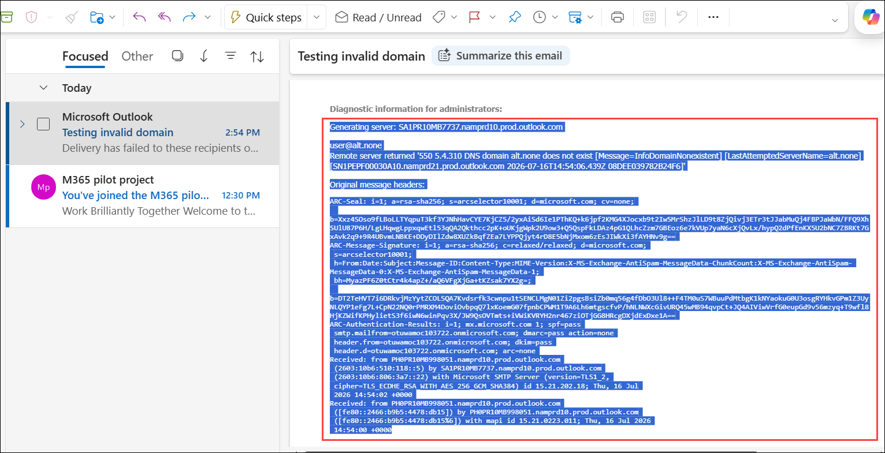

10. Open a new tab in your web browser and enter the following URL in the address bar: **https://testconnectivity.microsoft.com**.

11. This opens the **Microsoft Remote Connectivity Analyzer** portal. In the navigation bar on the left, select **Message Analyzer**. This opens the **Message Header Analyzer** tool.

    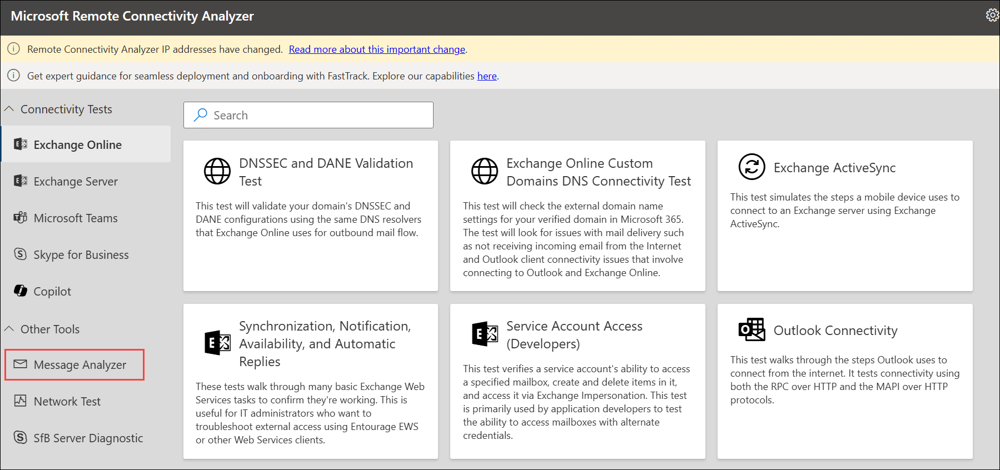

12. Take a moment to review the **Message Header Analyzer** tool. It consists of two sections:
    - In the top section, you will paste in the diagnostic data that you copied from the NDR email message.
    - In the bottom section, the tool will display its analysis of this data.

13. In the **Message Analyzer Header** window, paste the NDR diagnostic data (right-click and select **Paste**, or press **Ctrl+V**) in the field that appears below the **Insert the message header you would like to analyze** row. Then select the **Analyze headers** button.

    

14. Select the **Clear** option that appears to the right of the **Analyze headers** button; this will reset the Message Header Analyzer window.

15. Select the **Mail - Holly Dickson - Outlook** tab in your browser. In Holly's mailbox, select **New mail** to create a new email.

16. In this email, you will send the mail to a non-existent mailbox in a valid domain (outlook.com). In the **To** field, enter an email address consisting of a random series of numbers followed by your name (for example, **nnnnnnnnYourName@outlook.com**) **(1)**. In the drop-down menu that appears, select **Use this address: nnnnnnnnYourName@outlook.com**.

17. Enter **Testing invalid mailbox** in the **Subject (2)** field and then select **Send** **(3)**.

    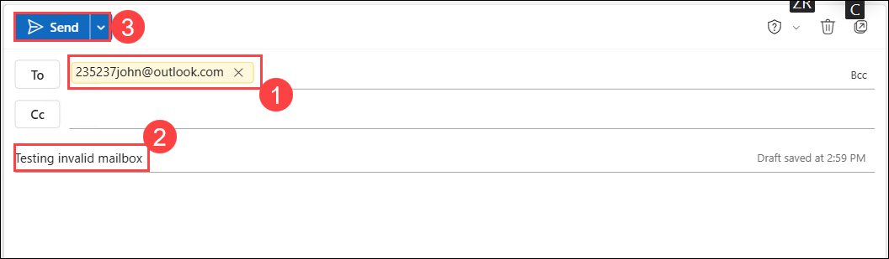

18. Wait for the non-delivery report (NDR) message to appear in Holly’s Inbox, then double-click the message to open it in a new window.

    > **Note:** If you do not receive an NDR reply within a minute (or less) after sending the email, then someone has created that mailbox in the outlook.com domain. If this occurs, then send another email to a different mailbox address that you feel is completely bogus. If necessary, continue trying different email addresses until you receive an NDR reply.

19. In the window for the NDR reply, scroll down through the message until you reach the body of text that says **Diagnostic information for administrators**. Select the text in the body of the message starting AFTER **Diagnostic information for administrators** through the end of the message. With this text selected, press **Ctrl+C** to copy it to the clipboard, and then close the message window.

20. Select the **Message Header Analyzer** tab in your browser.

21. In the **Message Analyzer Header** window, paste the NDR diagnostic data in the field that appears below the **Insert the message header you would like to analyze** row, and then select **Analyze headers**.

    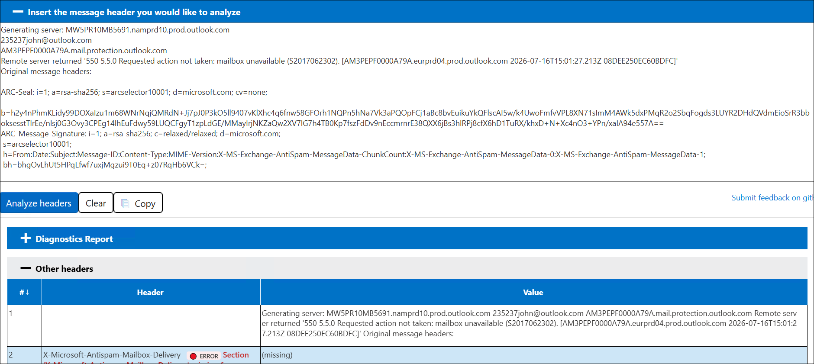

    > **Note:** Review the diagnostic information and the time taken for the message to be rejected. In the prior email, the domain of the email address did not exist. In this email, Hop 1 in the **Other headers** section indicates the user's domain (outlook.com) was valid, but the user mailbox was unavailable.

22. Close both the **Message Header Analyzer** tab and the **Microsoft Remote Connectivity Analyzer** tab in your Edge browser.

23. Select the **Microsoft 365 admin center** tab. If you had closed this tab, then select the **Microsoft 365 Copilot** tab in your Edge browser, on the **Microsoft 365 Copilot** page in the list of application icons that appear in the left-hand pane, select **Admin** this opens the **Microsoft 365 admin center** in a new browser tab.

24. On the **Microsoft 365 admin center** page, in the navigation pane, select **Show all** (if necessary).

25. Scroll down through the navigation pane, and under **Admin centers (1),** select **Exchange (2)**. This will open the Exchange admin center in a new tab.

    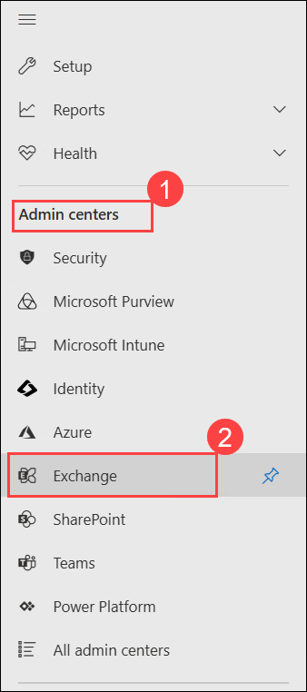

    > **Note:** If a **Toolbar** window appears, select the **Next** button twice and then the **Finish** button to navigate through the three windows. If a **Learn about the new menu** window appears, select the X to close it.

    > **Note:** If the Pick an account prompt appears, select Holly's account to sign in.

26. In the **Exchange admin center**, in the left navigation pane, select **Mail flow (1)**, and then select **Message trace (2)**.

    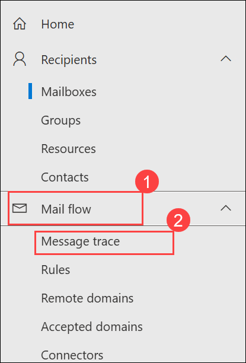

27. In the **Message trace** window, the **Default queries** tab is displayed by default. In this tab, select **+ Start a trace** on the menu bar.

    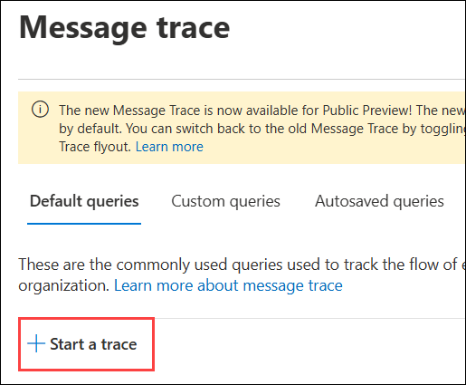

28. In the **New message trace** pane that appears, both the **Senders** and **Recipients** fields are set to **All** be default. Holly wants to configure the trace to just look for email messages that she sent. In the **Senders** field, enter **Holly**. This displays the list of active users whose name starts with Holly. In the list of users that appears, select **Holly Dickson**.

29. Under the **Time range** section, select the **slider** bar. Move the slider circle under **1 day**.

    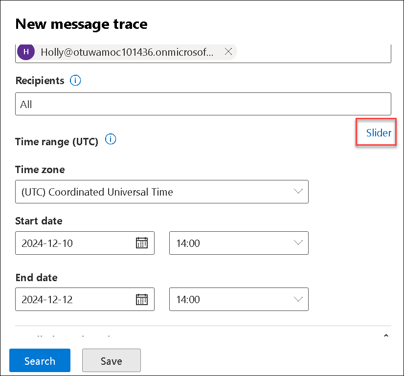

    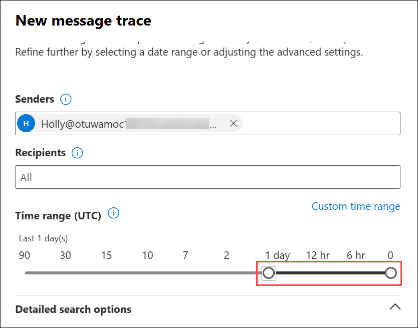

30. The drop-down arrow to the right of **Detailed search options** should be selected by default. This displays options such as Delivery status, Message ID, Direction, and others. If this information isn't displayed under **Detailed search options**, then select the drop-down arrow to expand this section. Holly wants to customize the trace to look for failed messages. Select the **Delivery status** field, and in the drop-down menu that appears, select **Failed**.

31. Note the **Report type** option is set to **Summary report**. This is the report type that you want to create, so leave this option selected. At the bottom of the page, select the **Search** button.

    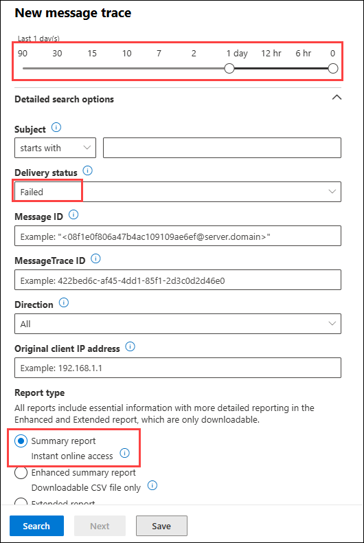

32. In the **Message trace search results** page that appears, if no failed message deliveries appear in the list, you may need to wait several minutes before selecting the **Refresh** button that appears above the item list. You should see the two failed email messages that Holly sent from Outlook - one to **user@alt.none**, and another to **nnnnnnnnYourName@outlook.com**.

    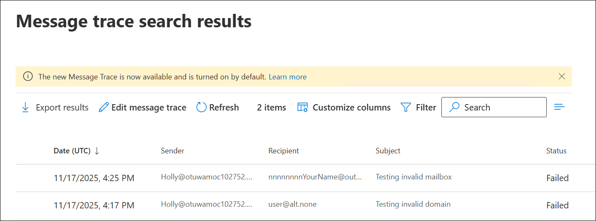

33. Select the date and time values (which are hyperlinked) for the first failed message to view the properties pane for that message. This displays the sender, recipient, status, and error information, as well as the **How to fix it** instructions. Select the down arrows for the **Message events** and **More information** sections to view those sections. Once you've finished reviewing the message information, select the **X** in the upper right corner of the pane to close it.

    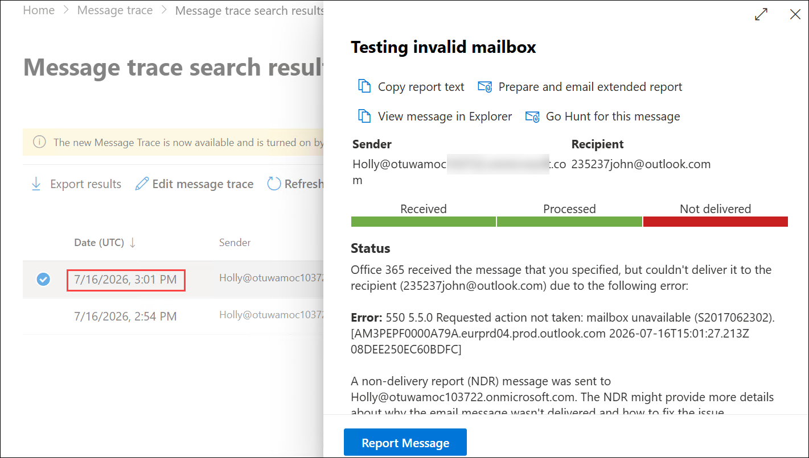

34. Repeat this step for the second failed message.

35. In the **Message trace search results** window, note the navigation thread at the top of the screen (**Home > Message trace > Message trace search results**). Select the **Message trace** portion of this navigation thread to display the **Message trace** window. Leave this tab open for the next task.

    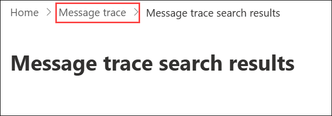

    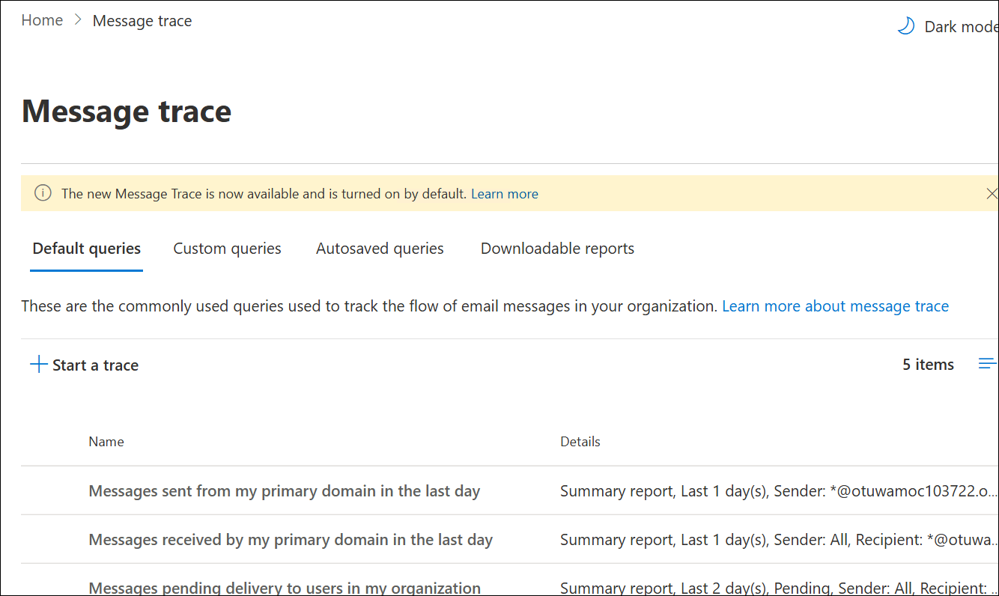

36. In your Edge browser, close the **Mail - Holly Dickson - Outlook** tab, but leave the remaining tabs open for the next task.

### Task 2 - Monitor Service Health and Analyze Reports

In this task, you will monitor the health of Microsoft 365 services and analyze usage and activity reports to identify potential issues or trends.

1. On the **LON-CL1** VM, go to the **Microsoft 365 admin center** tab within your Edge browser.

1. In the **Microsoft 365 admin center** navigation pane, select **Show all**, select **Health (1)** and then select **Service health (2)**.

   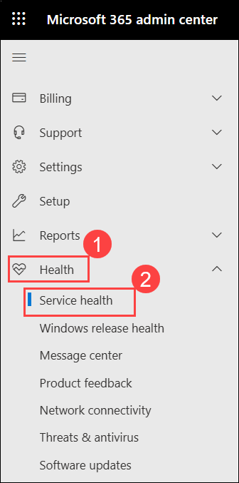

1. On the **Service health** page, the **Overview** tab is displayed by default. Select the **Issue history** tab.

1. In the **Issue history** tab on the **Service health** window, the default option is to display a list of items from the past 7 days (this filter option appears to the right of the **Search** field). In the list of service health incidents, select the **Title** for any entry in the list to see further details about the incident. Close the incident window when you’re done reviewing it.

   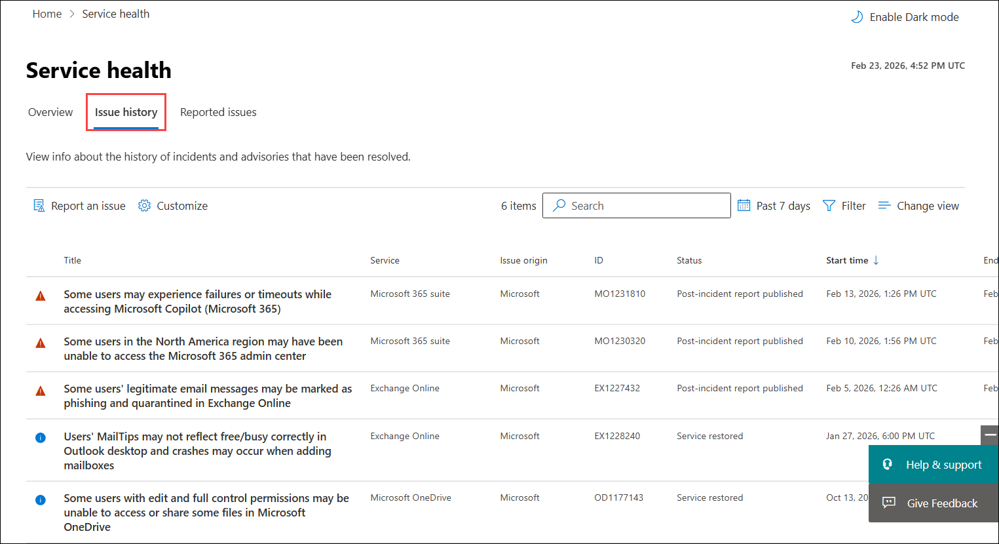

1. In the **Microsoft 365 admin center**, in the left navigation pane, select **Reports (1)**, and then select **Usage (2)**.

   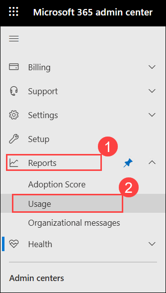

1. On the **Usage** page, scroll down and locate the **Microsoft 365 apps (1)** > **Active users (2)** chart.

   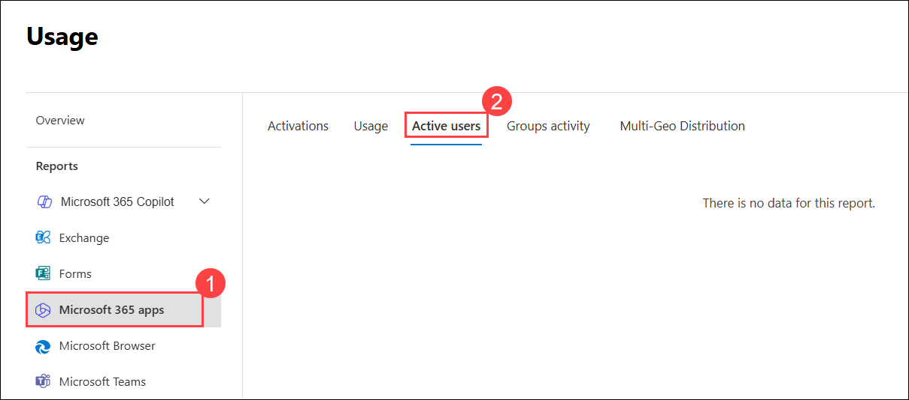

   > **Note:** If you are not able to see any charts, so as you can see the message on the Overview page, which displays **Microsoft 365 usage reports show how people in your business are using Microsoft 365 services. Reports are available for the last 7 days, 30 days, 90 days, and 180 days. Data won't exist for all reporting periods right away. The reports become available within 48 hours**.

   > 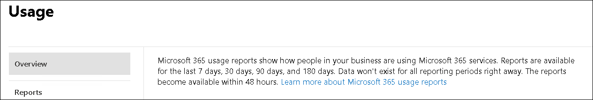

1. You now want to review the reports that are available in the **Exchange admin center**. In your browser, you should have the **Message trace - Exchange admin center** tab open from the prior task; if so, select it now. However, if you previously closed this tab, then in the **Microsoft 365 admin center**, under the **Admin centers** group in the navigation pane, select **Exchange**.

1. In the **Exchange admin center**, select **Reports (1)** in the navigation pane, and then select **Mail flow (2)**.

   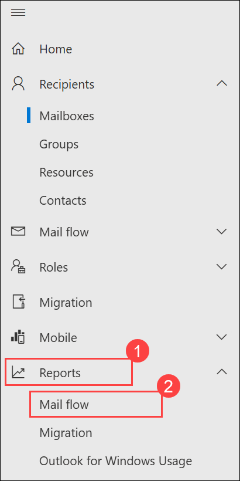

1. In the **Mail flow reports** window, select **Inbound messages report** (this report has data to view; none of the other reports have data). Review the information displayed for this report.

   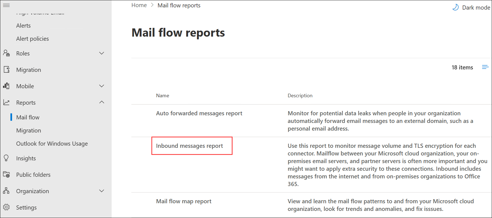

1. On the navigation thread at the top of the page (**Reports > Mail flow > Inbound messages report**), select **Mail flow** to return to this reporting page.

   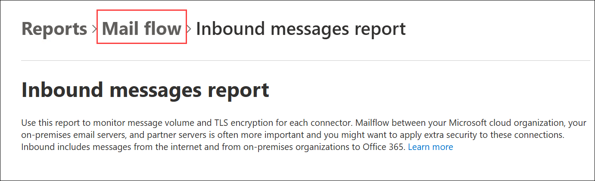

1. In the **Mail flow reports** window, review the various reports that are available.

1. Once you have finished reviewing several of the reports, close the **Exchange admin center** tab in your Edge browser but leave the other tabs open for the next task.

### Task 3 – Submit a Help Request to Microsoft Support

In this task, you will create and submit a support request through the Microsoft 365 admin center to resolve a technical issue with assistance from Microsoft support.

1. On **LON-CL1**, in the **Microsoft 365 admin center** tab of your Edge browser, select **Support (1)** in the navigation pane, and then select **View service requests (2)**.

   > **Note:** If the left-hand navigation pane has been minimized and only displays icons without any text, select the Navigation menu icon (the three horizontal lines) at the top of the navigation pane to expand it and display the accompanying text.

   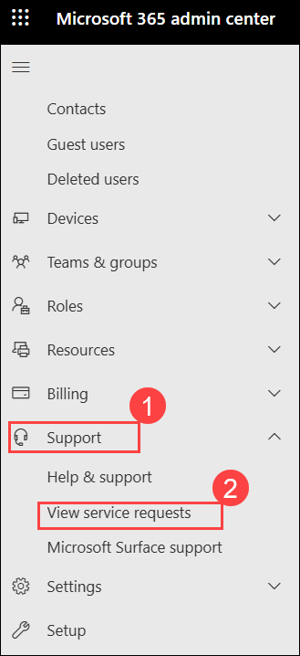

1. The **Service request history** window displays any outstanding service request tickets. You should verify that no service request tickets appear on this page.
1. In the navigation pane, under the **Support** group, select **Help & Support**.

1. In the **Support Assistant** pane that appears, locate the message input field at the bottom of the chat window. In the text box, type **Can’t install Office (1)**, and then select the **send (arrow) icon (2)** next to the field. The Support Assistant will respond with self-help solutions, insights, and recommended articles to help resolve your issue.

   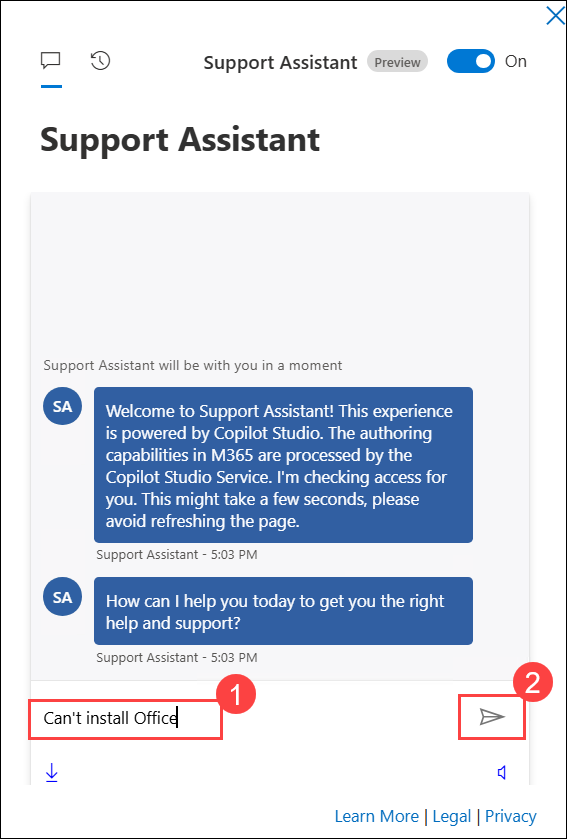

1. Select one of the recommended articles. After reviewing the article.

1. If you need further assistance and would like to speak to a Microsoft support agent, select the **Contact Support** icon (the middle icon) at the top of the Support article pane to get help from a Microsoft support agent. Select the **Contact Support** icon now.

   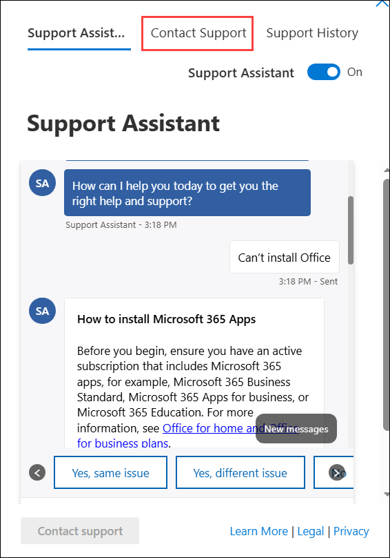

1. On the **Contact Support** page, review the information displayed under **Get support from an agent**. Do **not** select a support provider or enter any information. This page demonstrates the information you would provide when creating a support request in a real-world environment.

   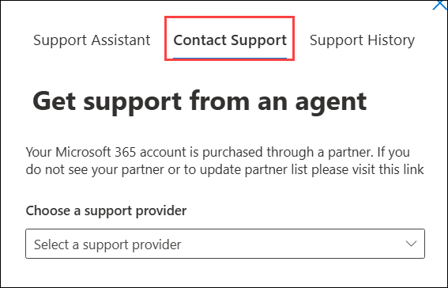

   > **Important:** Do **not** submit a support request in your lab environment. Creating a support request may result in Microsoft Support contacting you, which could unnecessarily impact Microsoft Support resources intended for production customers.

1. Select the **X** in the upper right-hand corner of the page to close the **Contact support** window.
1. Leave **LON-CL1** and your Edge browser open for the next lab exercise.

## Review

In this lab, you have:

- Troubleshooted Mail Flow in Microsoft 365.
- Monitored Service Health and Analyze Reports.
- Submit a Help Request to Microsoft Support.

## The lab has been completed successfully. Click **Next >>** to proceed to the next exercise.

