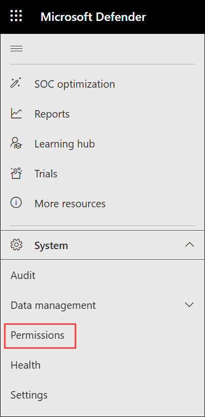
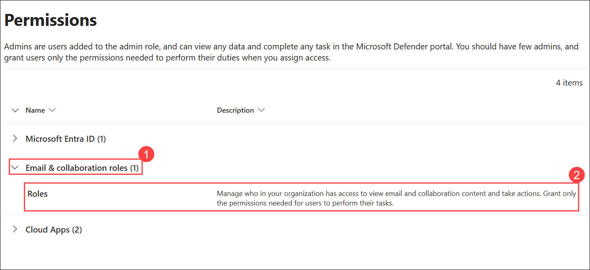
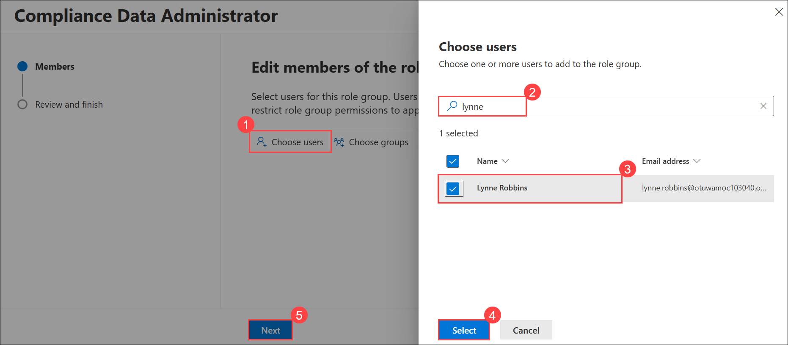
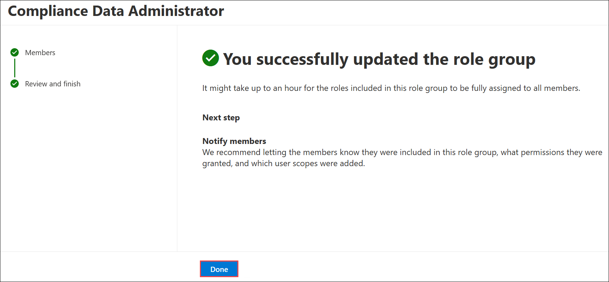
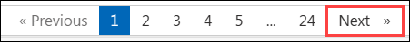

# Lab 06 - Exercise 1: Prepare for Alert Policies

> **!IMPORTANT**: `Once you launch the track, you’ll have access to a virtual machine (VM) for 40 hours. The displayed track duration of 30 days indicates the time frame during which you can use your VM. Please plan your lab sessions accordingly. If the VM uptime of 40 hours is fully exhausted before completing the labs, access will be lost. To avoid this and for detailed instructions on VM usage and stopping/deallocating the VM, refer to the Getting Started page.`

> `If the full 40 hours of VM uptime is exhausted, the VM will no longer be accessible, and **the lab duration cannot be extended**.`

## Lab scenario

Alerts are policies designed to automatically notify administrators when key actions have occurred in their Microsoft 365 tenant. Alerts can be an easy way to ensure that change logs are up-to-date and that business policies are being followed inside your Microsoft 365 tenant.

In your role as Holly Dickson, Adatum’s new Microsoft 365 Administrator, you have Microsoft 365 deployed in a virtualized lab environment. One of Adatum’s business requirements is to set up an alert notification system so that targeted administrators are automatically notified through email when certain actions occur. As you proceed with your Microsoft 365 pilot project, you want to test out Microsoft 365’s alert notification system by creating and validating several types of alerts.

There are two requirements to implementing alerts in Microsoft Defender XDR – turning on Audit Logging and assigning the proper Role Based Access Control (RBAC) permissions to the users who will view alerts. 

- **Audit logging.** If you recall, towards the end of Lab 1 you turned on Audit Logging. You performed this task in Lab 1 because it can take an hour or two to propagate that setting through the system before you can successfully implement alerts. This propagation should have completed by now, and you should be ready to go.

- **RBAC permissions.** In this exercise, you will assign the necessary RBAC role group to Lynne Robbins, who is the user that Holly selected for testing alerts in Adatum's Microsoft 365 pilot project. 

> **!IMPORTANT**: Once you launch the track, you’ll have access to a virtual machine (VM) for **40 hours**. The displayed track duration of **30 days** indicates the time frame during which you can use your VM. Please plan your lab sessions accordingly. If the VM uptime of **40 hours** is fully exhausted before completing the labs, access will be lost. To avoid this and for detailed instructions on VM usage and stopping/deallocating the VM, refer to the Getting Started page.  

> If the full 40 hours of VM uptime is exhausted, the VM will no longer be accessible, and **the lab duration cannot be extended**.

### Task 1 – Assign RBAC Permissions for Alert Notification Testing

The alerts a user can see on the **View alerts** page are dependent on the user's assigned RBAC roles, which determine the depth of insight and control a user has. How is this accomplished? The management roles assigned to users (based on their membership in role groups in Microsoft 365) determine which alert categories a user can see on the **View alerts** page (this was covered in the topic on Alerts in the previous module). 

For Adatum’s pilot project, Lynne Robbins has been selected to test the alert notification system. For Lynne to be able to view alerts and receive alert notifications, she must first be assigned appropriate RBAC permissions in Microsoft Defender XDR.

The three alerts that you will create in this lab are assigned to two Alert categories: **Permissions** and **Data Loss Prevention**. The Compliance Data Administrator role group, which includes the Compliance Administrator role, provides permissions for these two alert categories; therefore, assigning Lynne Robbins to this role group will enable her to view the alerts that are created in this lab.

|                               | **Data governance** | **Data loss prevention** | **Mail flow** | **Permissions** | **Threat Management** | **Others** |
|:-------------------------------:|:---------------------:|:--------------------------:|:---------------:|:-----------------:|:-----------------------:|:------------:|
| Compliance Data Administrator | X                   | X                        |               | X               |                       | X          |

Perform the following steps to assign Lynne Robbins the Compliance Data Administrator role group, which includes the Compliance Administrator role.

1. At the end of the previous lab, you were logged into LON-CL2. This lab will use LON-CL1. Switch to **LON-CL1**. 

2. On **LON-CL1**, in your Edge browser, you should still be logged into Microsoft 365 as **Holly Dickson**. 

3. If necessary, select the **Microsoft 365 admin center** tab in your browser. In the left-hand navigation pane, under the **Admin centers** group, select **Security**. This opens the Microsoft 365 Defender portal in a new tab.

4. In the **Microsoft 365 Defender** portal, scroll down towards the bottom of the left-hand navigation pane and expand the **System** section a and select **Permissions**.

    

5. On the **Permissions** page, there are four sections - Microsoft Entra ID, Email & collaboration roles and Cloud Apps. Under the **Email & collaboration roles (1)** section, select **Roles (2)**. 

    

6. In the list of roles that appears, select the **Name** column heading to sort the roles in ascending alphabetical name order. Select the **Compliance Data Administrator** role group.

7. In the **Compliance Data Administrator (1)** pane that appears, note the list of roles that have been assigned to this role group and select **Edit (2)**.

    .png)

8. In the **Edit members of the role group** window, select **Choose users (1)** under the Members pane. 

9. In the **Choose users** window, in the search filed type **Lynne (2)** press enter, select the check box next to **Lynne Robbins (3)** and then click on **Select (4)** button.

10. In the **Edit members of the role group** window, select **Next (5)**.

    

11. In the **Review the role group and finish** window, select **Save**.

12. The message will show that **You successfully updated the role group**, select **Done**.

    

13. Leave all tabs in your Edge browser open for the next lab exercise.

You have now added Lynne Robbins to the Compliance Data Administrator role group.

## Review

In this lab, you have:

- Assigned RBAC Permissions for Alert Notification Testing.

## The lab has been completed successfully. Click **Next >>** to proceed to the next exercise.
 