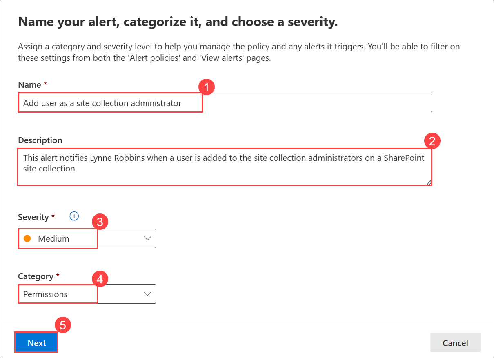
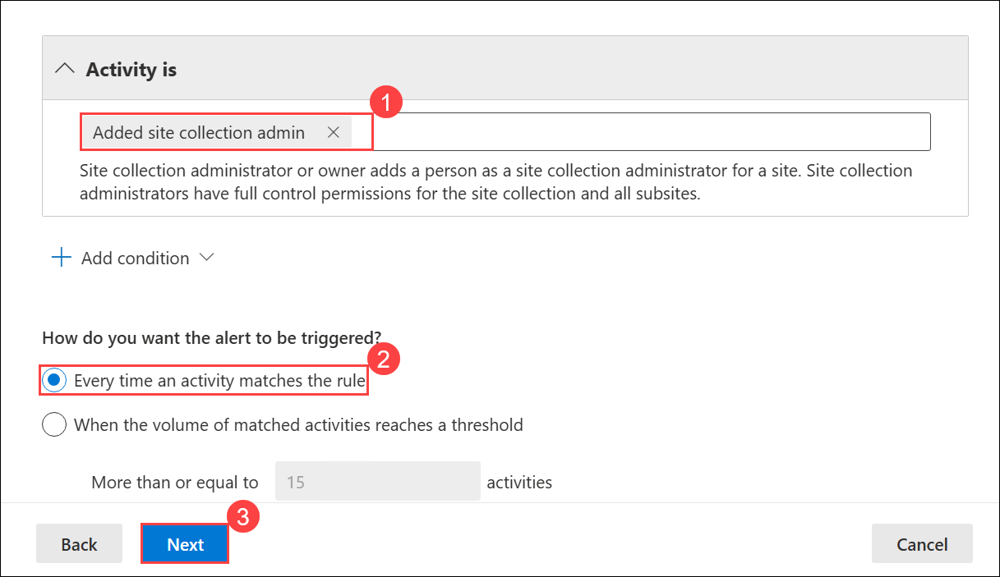
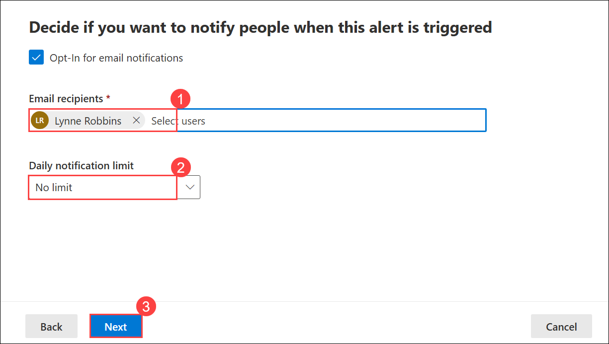
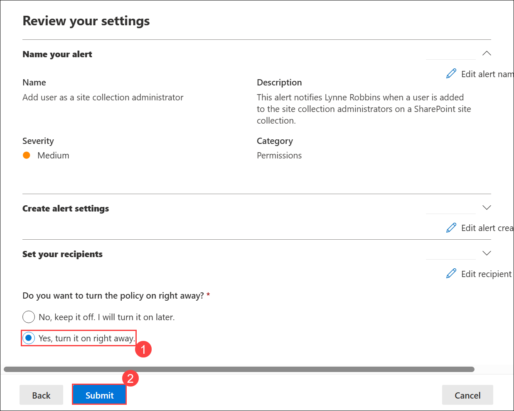
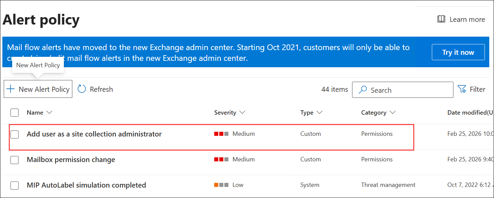
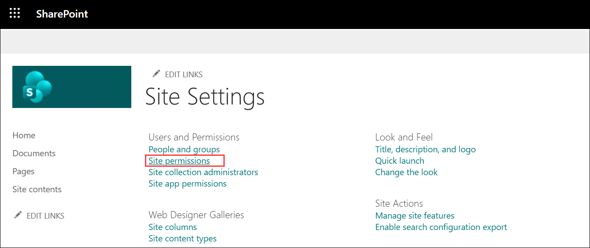
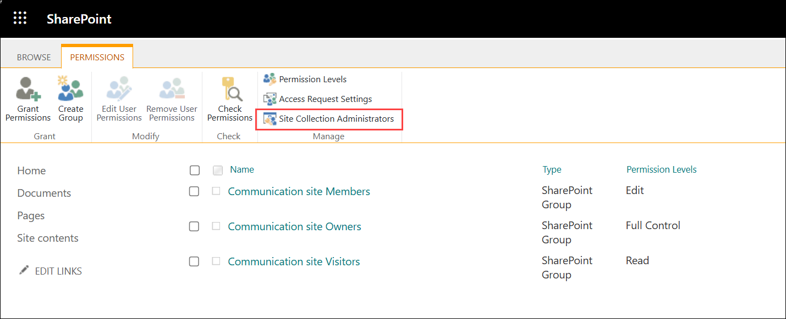
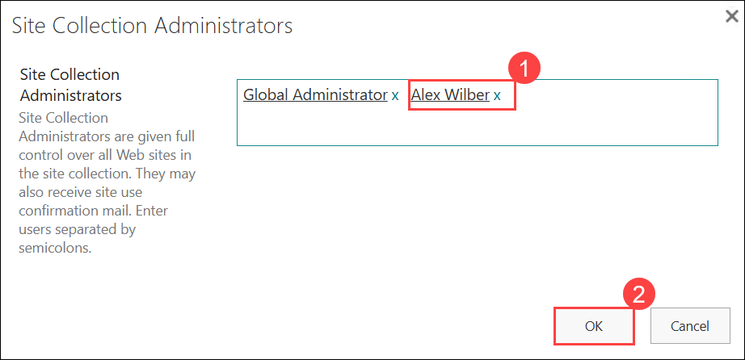

# Lab 06 - Exercise 3: Implement SharePoint Permission Alert

> **!IMPORTANT:** `Once you launch the track, you’ll have access to a virtual machine (VM) for 40 hours. The displayed track duration of 4 days and 8 hours is based on an estimated usage of 8 hours per day. Please plan your lab sessions accordingly. If the VM uptime of 40 hours is fully exhausted before completing the labs, access will be lost. To avoid this and for detailed instructions on VM usage and stopping/deallocating the VM, refer to the Getting Started page.`

> `If the full 40 hours of VM uptime is exhausted, the VM will no longer be accessible, and the lab duration cannot be extended.`

## Lab scenario

In this exercise you will configure and test an alert that notifies Lynne Robbins when a user is added as a site collection administrator for a SharePoint site collection.

> **!IMPORTANT**: Once you launch the track, you’ll have access to a virtual machine (VM) for **40 hours**. The displayed track duration of **30 days** indicates the time frame during which you can use your VM. Please plan your lab sessions accordingly. If the VM uptime of **40 hours** is fully exhausted before completing the labs, access will be lost. To avoid this and for detailed instructions on VM usage and stopping/deallocating the VM, refer to the Getting Started page.  

> If the full 40 hours of VM uptime is exhausted, the VM will no longer be accessible, and **the lab duration cannot be extended**.

### Task 1 – Create a SharePoint Permissions Alert

In this task, you will set up an alert in SharePoint to notify users or administrators whenever there is a change in permissions within a document library or site. This helps track permission modifications and ensures proper access control.

1. At the end of the prior lab, you were logged into LON-CL2. This lab will use LON-CL1. Switch to **LON-CL1**.

2. On **LON-CL1**, in your Edge browser, you should still be logged into Microsoft 365 as **Holly Dickson**. In your Edge browser, select the **Alert policy - Microsoft 365 security** tab, which displays the **Microsoft 365 Defender** portal.

3. In the **Microsoft 365 Defender** tab, you should still be in the **Alert policy** window from the prior lab exercise (if not, then in the left-hand navigation pane, select **Policies & rules** and then select **Alert policy**).

4. In the **Alert policy** window, select **+ New Alert Policy** on the menu bar. This initiates the **New Alert Policy** wizard.

5. On the **Name your alert, categorize it, and choose a severity** window, enter the following information:

	- Name: **Add user as a site collection administrator (1)**

	- Description: **This alert notifies Lynne Robbins when a user is added to the site collection administrators on a SharePoint site collection. (2)**

	- Severity: **Medium (3)**

	- Category: **Permissions (4)**

6. Select **Next (5)**.

	

7. On the **Choose an activity, conditions and when to trigger the alert** window, enter the following information:

	- Activity is: select the **Select an activity** field, then in the menu that appears, scroll down to the **Site administration activities** section and select **Added site collection admin (1)**

	- How do you want the alert to be triggered? **Every time an activity matches the rule (2)**

8. Select **Next (3)**.

	

9. On the **Decide if you want to notify people when this alert is triggered** window, enter the following information:

	- Email recipients: Remove **Holly Dickson** and add **Lynne Robbins (1)**

	- Daily notification limit: **No limit (2)**

10. Select **Next (3)**.

	

11. On the **Review your settings** page, under the **Do you want to turn the policy on right away?** option, select **Yes, turn it on right away (1)** and then select **Submit (2)**. 

	

12. On the **New Alert Policy** window, select **Done**.

13. Verify your new alert policy appears in the list on the **Alert policy** page, its **Type** is set to **Custom**, and its **Status** in **On**.

	

14. Leave all the Edge browser tabs open for the next task.

You have now configured an additional alert policy that monitors when a user is added as a site collection administrator for a SharePoint Online site collection.

### Task 2 – Validate the  SharePoint Permissions Alert

In this task, you will test the SharePoint permissions alert you created in Task 1 to ensure it is functioning correctly. You will verify that the alert triggers as expected when permission changes occur, confirming its accuracy and reliability.

>**Note:** This task is currently read-only because alert emails intended for Lynne's inbox are not appearing. This issue originates from Microsoft's end, and we are actively working to resolve it.

In the prior task, you configured an alert designed to notify Lynne Robbins when a user is added as a site collection administrator for a site collection. In this task, you will test this alert by adding Alex Wilber as a site collection admin to the global SharePoint Communication site. This activity should trigger the alert policy that you created, which should send an alert notification email to Lynne Robbins’ mailbox.

1. On LON-CL1, in your Edge browser, you should still be logged into Microsoft 365 as **Holly Dickson**. 

1. In your **Microsoft Edge** browser, open a new tab and enter the following URL in the address bar: **https://otuwamocZZZZZZ.sharepoint.com/_layouts/15/settings.aspx (replace ZZZZZZ with the tenant prefix provided by your lab hosting provider)**. This opens the **Site Settings** for the global SharePoint Communication site.

	>**Note:** For example, in **odl_user_<inject key="DeploymentID" enableCopy="false"/>@otuwamocZZZZZZ.onmicrosoft.com**, the highlighted portion (**otuwamocZZZZZZ.onmicrosoft.com**) represents the domain name or tenant prefix, which you can replace with your desired tenant prefix.

	> **Note:** If you’re prompted to sign in, use the account for Holly Dickson.

1. On the **Site Settings** window, under the **Users and Permissions** section, select **Site permissions**. 

	

1. In the ribbon at the top of the page, the **Permissions** tab is displayed by default. Under the **Manage** drop-down, select **Site Collection Administrators**.

	

1. In the **Site Collection Administrators** dialog box, the Global administrator account that was assigned by default to this role group is displayed in the data entry field. To the right of this account, enter **Alex**, select **Alex Wilber (1)** from the list of users that appears, and then select **OK (2)**. 

	

1. Switch to **LON-CL2** and open **Outlook**, where you are logged in as **Lynne**.

1. Once the email arrives in Lynne's Inbox, open the email and review the contents. Scroll to the bottom of the email and select the **View alert details** button. This opens the **Microsoft 365 Defender** portal in a new tab.

   >**Note:** It takes up to 24 hours after creating or updating an alert policy before alerts can be triggered by the policy. This is because the policy has to be synced to the alert detection engine.

1. Once the email arrives in Lynne's Inbox, open the email and review the contents. Scroll to the bottom of the email and select the **View alert details** button. This opens the **Microsoft 365 Defender** portal in a new tab.

1. The **Microsoft 365 Defender** portal displays the **Alerts** window, and it automatically opens the **Site collection admin permissions** pane for this alert activity that triggered the email notification to Lynne.  

	Scroll down through the **Site collection admin permissions** pane and review all the information for this alert activity. When you are done, select **Close** to close the pane.

1. Leave your LON-CL1 and LON-CL2 VMs open for the remaining exercise in this lab.

You have now successfully tested the SharePoint alert to monitor site collection admin permissions on SharePoint sites.  

## Review

In this lab, you have:

- Created a SharePoint Permissions Alert.
- Validated the  SharePoint Permissions Alert.

## The lab has been completed successfully. Click **Next >>** to proceed to the next exercise.

 