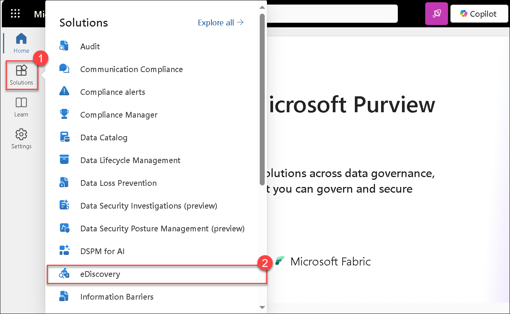
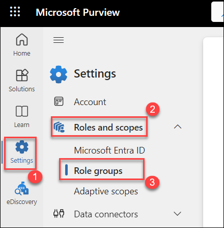
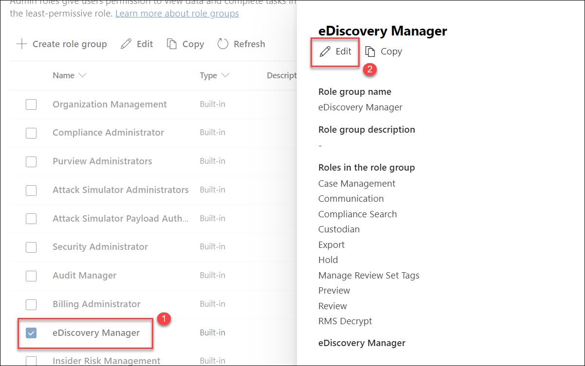
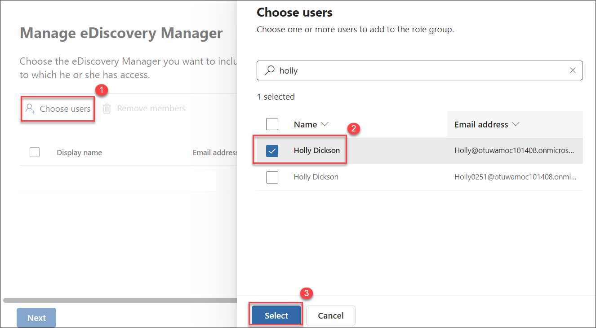

# Lab 06 - Exercise 4: Test the Default eDiscovery Alert

## Lab scenario

In this exercise you will test a default Microsoft 365 alert policy that notifies all tenant administrators, such as Holly Dickson, whenever an eDiscovery search has been created or exported.

>**Note:** Creating an eDiscovery alert of this nature is important because an eDiscovery search, when left unregulated, can pull sensitive content that can be exported to an unauthorized source.

### Task 1 – Review the default eDiscovery Alert 

In this task, you will verify whether a default Microsoft 365 alert is triggered when somebody in your tenant creates an eDiscovery search or exports data from an existing search. Since Holly Dickson is assigned the Global Administrator role, she is automatically a member of the Tenant Admins and will be one of the recipients of this alert.

1. You should still be in **LON-CL2** after completing the prior lab exercise. You should now switch back to **LON-CL1**.

1. On **LON-CL1**, in your Edge browser, you should still be logged into Microsoft 365 as **Holly Dickson**. 

1. In your Edge browser, select the **Alert policy - Microsoft 365 security** tab. This tab should still be displaying the **Alert policy** window from the prior lab exercise (if not, then in the left-hand navigation pane, select **Policies & rules** and then select **Alert policy**).

1. On the **Alert policy** page, you want to search through the default System policies for a policy named **eDiscovery search started or exported**. Since there are so many pre-existing system policies, the easiest way to locate the policy is to search for it. In the **Search** field at the top of the screen, enter **eDiscovery** and then hit Enter. 

1. In the policy list, select the **eDiscovery search started or exported** policy that appears. 

1. An **eDiscovery search started or exported** pane should appear. Scroll down through the pane and verify the default settings for this predefined policy are configured as follows:

	- Status: **On**
	
	- Conditions: Select the down arrow for the **Create alert settings** section to expand it, then verify the following settings:

		- Conditions: **Activity is eDiscoverySearchStartedOrExported**

		- Aggregation: **Single event**

		- Scope: **All users**

	- Email recipients: Select the down arrow for the **Set your recipients** section to expand it, then verify the following settings: 

		- Recipients: **TenantAdmins**

		- Daily notification limit: **No limit**

1. At the top of the pane, select the **Edit policy** button.

1. On the **eDiscovery search started or exported** window that appears, the only setting that can be edited for this default policy is the **Email recipients** setting. This window enables you to edit the email recipients who are notified when this policy is triggered. You will not change the value here; instead, the purpose of this step is to show you how to change the recipient list in your real-world implementations for any of the default system policies. Select the **Cancel** button at the bottom of the window.

1. On the **eDiscovery search started or exported** pane, select the **X** in the upper-right corner to close it. 

	>**Note:** You can also edit a policy's setting by selecting the vertical ellipsis icon under the **Actions** column at the far-right end of the policy's row on the **Alert Policy** window. 

1. Leave all the Edge browser tabs open for the next task.

You have now reviewed the default Microsoft 365 eDiscovery alert that notifies tenant admins when an eDiscovery search is created or exported.

### Task 2 – Validate the default eDiscovery Alert

To test this default alert, Holly Dickson will create an eDiscovery search. This activity should trigger the alert policy, which should send an alert notification email to all Tenant Admins. Holly is a Global admin. By default, Global admins are members of the Tenant Admin group; therefore, she should receive the email notification generated by this alert. You will validate whether Holly received the email.

1. On **LON-CL1**, in your Edge browser, you should still be logged into Microsoft 365 as **Holly Dickson**.  

2. In your Edge browser, select the **Microsoft Purview** admin center tab.  

1. In the **Microsoft 365 admin center**, in the left-hand navigation pane under the **Admin centers** group, select **Compliance**.

1. In the **Microsoft Purview** portal, in the left-hand navigation pane, select **Solutions (1)** select **eDiscovery (2)** group, and Under **eDiscovery**, select **Content Search**.

	

	> **Note:** If you encounter an **permission error -** _You are not a member of the content search case_ please follow the below steps to add the eDiscovery manager role to Holly.
	> - In the **Microsoft Purview** portal from the left pane click on **Settings (1)**, expand **Roles and scopes (2)** and select **Role groups (3)**.

	  

	> - In the list of Role groups, select **eDiscovery Manager (1)** and click on **Edit (2)**.
 
	  

	> - In the **eDiscovery Manager** page, click on **Choose users (1)** and search and select for **Holly Dickson (2)** and click on **Select (3)**. Now click on **Next** twice, select **Save** and **Done**.
	
	  

1. On the **Searches** tab, select **Create a search**. This initiates the **New search wizard**.  

1. In the **New search** wizard, on the **Name and description** page, enter **Confidential search** in the **Name** field and then select **Create**.

1. In the **Confidential search** window, select **Add sources**.  
   - In the search pane, locate and select the **Sales and Marketing** mailbox (or, if not available, select **All mailboxes**).  
   - Select **Save and close**.  

1. On the **Query** tab, in the condition builder, enter **Confidential** in the keyword field, and then press **Enter**.  

1. Select the **Run query** button.  

1. On the **Choose search results** page, leave the default values, and then select **Run query** again.  

1. Back on the **Confidential search** window, the **Statistics** tab should now display results.  

   **Note:** Running this search should trigger the **eDiscovery alert**, which generates an email notification to all users with Tenant Admin permissions. It may take several minutes for the email to be delivered. Instead of waiting, proceed to the next exercise.

Leave your browser open in **LON-CL1** and do not close any tabs.  

## Review

In this lab, you have:

- Reviewed the default eDiscovery Alert.
- Validated the default eDiscovery Alert.

## The lab has been completed successfully. Click **Next >>** to proceed to the next exercise.
