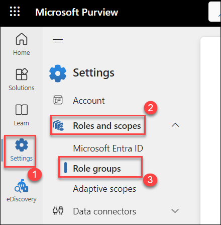
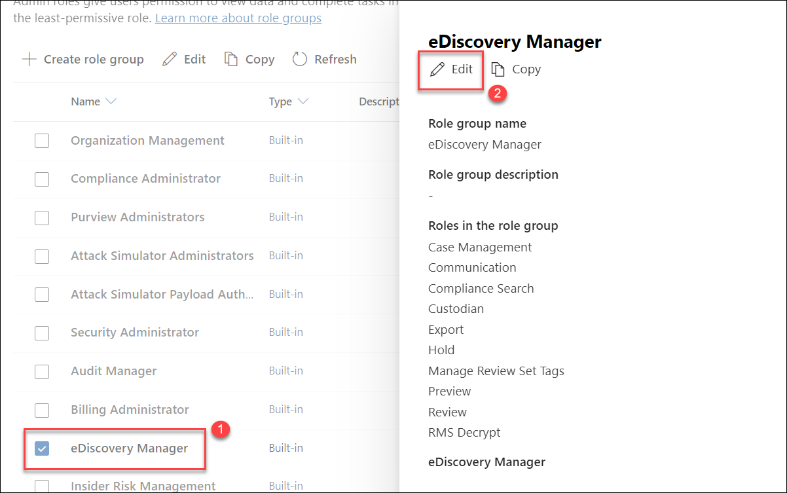
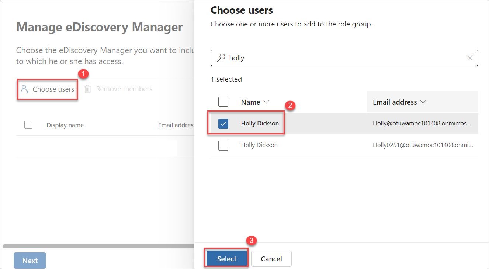

# Learning Path 6 - Lab 6 - Exercise 4 - Test the Default eDiscovery Alert

## Lab scenario

In this exercise you will test a default Microsoft 365 alert policy that notifies all tenant administrators, such as Holly Dickson, whenever an eDiscovery search has been created or exported.

>**Note:** Creating an eDiscovery alert of this nature is important because an eDiscovery search, when left unregulated, can pull sensitive content that can be exported to an unauthorized source.

### Task 1 – Review the default eDiscovery Alert 

In this task, you will verify whether a default Microsoft 365 alert is triggered when somebody in your tenant creates an eDiscovery search or exports data from an existing search. Since Holly Dickson is assigned the Global Administrator role, she is automatically a member of the Tenant Admins and will be one of the recipients of this alert.

1. You should still be in **LON-CL2** after completing the prior lab exercise. You should now switch back to **LON-CL1**.

2. On **LON-CL1**, in your Edge browser, you should still be logged into Microsoft 365 as **Holly Dickson**. 

3. In your Edge browser, select the **Alert policy - Microsoft 365 security** tab. This tab should still be displaying the **Alert policy** window from the prior lab exercise (if not, then in the left-hand navigation pane, select **Policies & rules** and then select **Alert policy**).

4. On the **Alert policy** page, you want to search through the default System policies for a policy named **eDiscovery search started or exported**. Since there are so many pre-existing system policies, the easiest way to locate the policy is to search for it. In the **Search** field at the top of the screen, enter **eDiscovery** and then hit Enter. 

5. In the policy list, select the **eDiscovery search started or exported** policy that appears. 

6. An **eDiscovery search started or exported** pane should appear. Scroll down through the pane and verify the default settings for this predefined policy are configured as follows:

	- Status: **On**
	
	- Conditions: Select the down arrow for the **Create alert settings** section to expand it, then verify the following settings:

		- Conditions: **Activity is eDiscoverySearchStartedOrExported**

		- Aggregation: **Single event**

		- Scope: **All users**

	- Email recipients: Select the down arrow for the **Set your recipients** section to expand it, then verify the following settings: 

		- Recipients: **TenantAdmins**

		- Daily notification limit: **No limit**

7. At the top of the pane, select the **Edit policy** button.

8. On the **eDiscovery search started or exported** window that appears, the only setting that can be edited for this default policy is the **Email recipients** setting. This window enables you to edit the email recipients who are notified when this policy is triggered. You will not change the value here; instead, the purpose of this step is to show you how to change the recipient list in your real-world implementations for any of the default system policies. Select the **Cancel** button at the bottom of the window.

9. On the **eDiscovery search started or exported** pane, select the **X** in the upper-right corner to close it. 

	>**Note:** You can also edit a policy's setting by selecting the vertical ellipsis icon under the **Actions** column at the far-right end of the policy's row on the **Alert Policy** window. 

10. Leave all the Edge browser tabs open for the next task.

You have now reviewed the default Microsoft 365 eDiscovery alert that notifies tenant admins when an eDiscovery search is created or exported.

### Task 2 – Validate the default eDiscovery Alert

To test this default alert, Holly Dickson will create an eDiscovery search. This activity should trigger the alert policy, which should send an alert notification email to all Tenant Admins. Holly is a Global admin. By default, Global admins are members of the Tenant Admin group; therefore, she should receive the email notification generated by this alert. You will validate whether Holly received the email.

1. On LON-CL1, in your Edge browser, you should still be logged into Microsoft 365 as **Holly Dickson**. 

1. In your **Microsoft Edge** browser, select the **Microsoft 365 admin center** tab. 

1. In the **Microsoft 365 admin center**, in the left-hand navigation pane under the **Admin centers** group, select **Compliance**.

1. In the **Microsoft Purview** portal, in the left-hand navigation pane, select **eDiscovery (1)** group, select **Content search (2)**.

	

	> **Note:** If you encounter an **permission error -** _You are not a member of the content search case_ please follow the below steps to add the eDiscovery manager role to Holly.
	> - In the **Microsoft Purview** portal from the left pane click on **Settings (1)**, expand **Roles and scopes (2)** and select **Role groups (3)**.

	  

	> - In the list of Role groups, select **eDiscovery Manager (1)** and click on **Edit (2)**.
 
	  

	> - In the **eDiscovery Manager** page, click on **Choose users (1)** and search and select for **Holly Dickson (2)** and click on **Select (3)**. Now click on **Next, Next and Save**.
	
	  

   
1. The **Content search** window has two tabs - a **Search** tab and an **Export** tab. The **Search** tab is displayed by default. Select the **+ New search** option that appears on the menu bar. This initiates the **New search** wizard.

1. In the **New search** wizard, on the **Name and description** page, enter **Confidential search** in the **Name** field and then select **Next**.

1. In the **Locations** page, the **Specific locations** option is selected by default. There are three groups of locations under this option, each of which can be turned On or Off through its respective toggle switch. Turn the toggle switch **On** for **Exchange mailboxes**, but leave the toggle switches **Off** for the other two locations. 

	>**Note:** The **Included** setting is set to **All** by default. This value indicates that all mailboxes will be included in the search. In a real-world deployment, you can optionally select **Choose users, groups, or teams** to choose specific mailboxes if you wish. For this lab, leave the value set to **All** so that it searches all mailboxes.

	>**Warning:** At least one of the three locations must be set to **On**; otherwise, you will receive an error.  

1. Select **Next**. 

1. In the **Define your search conditions** page, enter **Confidential** in the **Enter keywords** field and then select **Next**.

1. In the **Review your search and create it** page, review the settings and edit any (if necessary) to make any corrections. Once all the search settings are correct, select **Submit**. 

1. On the **New search created** page, select **Done**.

1. On the **Content search** page, scroll to the far-right side of the page. Note the **Status** of the **Confidential search** is **Starting**. 

	>**Important:** When you submit a new search, the system saves the search and then immediately runs it. By saving this eDiscovery search, the eDiscovery alert should be triggered, thereby creating an email notification that should be sent to the Inbox of all users with Tenant Admin permissions. You do NOT have to wait for the Search to finish before testing whether the alert sent the email notification. The alert notification system will process the email at the time the search is created. 

	
	
1. The search that you created should only take a couple of minutes to complete. You can either proceed to the next step while the search is running, or if you wish, you can select the **Refresh** icon on the menu bar every minute or so until the **Status** changes to **Completed**.
	
1. To test this alert, select the **Outlook** tab in your Edge browser. This should still be displaying Holly's mailbox. If you previously closed Outlook, then in the **Home | Microsoft 365** tab, in the column of application icons, select **Outlook**.

1. In Holly's Outlook mailbox, monitor her Inbox for an **Informational-severity alert: eDiscovery search started or exported** email that was automatically sent by the Alerts notification system. The purpose of this message is to inform Holly that an eDiscovery search was created or exported. If necessary, select the **Refresh** icon to the left of the URL address. Once the email is received, open it and review the contents, then close the message. 
	
	>**Note:** It may take up to 24 hours for the email to arrive in Holly's inbox. You can proceed with the lab, and after 24 hours, you can check on it.

1. In your **Edge** browser, switch back to the **Microsoft Purview** portal (the **Content search - Microsoft Purview** tab) and under the **Solutions** group in the left-hand navigation pane, select **Audit**. 

1. Select the **Search** button to display all recent activity. This will display the activity that created this alert. If an **Add more filters to your search?** dialog box appears, select **Start search**. 
	
	>**Note:** It may take up to 24 hours for the search results to be displayed. If search results do not appear immediately, check again later in the day. If there are still no results, wait until the following day before checking again.
	>**Note:** In the list of search results, note how the **User** for the prior alerts is listed as Holly, while the user for the eDiscovery alert is listed as **Service Account**. This is because the eDiscovery alert is a default system alert rather than a custom alert created by an individual user.

1. In your browser, leave the Outlook tab (**Mail - Holly Dickson - Outlook**) open as you will use it shortly in another lab exercise. Leave all your other browser tabs open as well.
	
	> **Note**: When you submit a new search, the system saves the search and then immediately runs it. By saving this eDiscovery search, the eDiscovery alert should be triggered, thereby creating an email notification that should be sent to the Inbox of all users with Tenant Admin permissions. It may take an additional 15 minutes for the email notification to be generated to validate this eDiscovery alert. Instead of waiting for this email to be generated, proceed to the next exercise.

1. You have now successfully tested the Microsoft 365 eDiscovery system alert that monitors the creation of an eDiscovery search or the export of data from a completed search.

## Review

In this lab, you have:

- Reviewed the default eDiscovery Alert.
- Validated the default eDiscovery Alert.

## Proceed to the next exercise.
