# Lab 06 - Exercise 5: Conduct a Spear Phishing attack using Attack Simulation training

> **!IMPORTANT**: `Once you launch the track, you’ll have access to a virtual machine (VM) for 40 hours. The displayed track duration of 30 days indicates the time frame during which you can use your VM. Please plan your lab sessions accordingly. If the VM uptime of 40 hours is fully exhausted before completing the labs, access will be lost. To avoid this and for detailed instructions on VM usage and stopping/deallocating the VM, refer to the Getting Started page.`

> `If the full 40 hours of VM uptime is exhausted, the VM will no longer be accessible, and the lab duration cannot be extended.`

## Lab scenario

Holly Dickson is concerned that some users at Adatum may require education about phishing attacks. As part of her pilot project, Holly has decided to use the Microsoft 365 Attack simulation training feature to determine her users' susceptibility to phishing attacks.

> **!IMPORTANT**: Once you launch the track, you’ll have access to a virtual machine (VM) for **40 hours**. The displayed track duration of **30 days** indicates the time frame during which you can use your VM. Please plan your lab sessions accordingly. If the VM uptime of **40 hours** is fully exhausted before completing the labs, access will be lost. To avoid this and for detailed instructions on VM usage and stopping/deallocating the VM, refer to the Getting Started page.

> If the full 40 hours of VM uptime is exhausted, the VM will no longer be accessible, and **the lab duration cannot be extended**.

### Task 1: Configure and launch a Spear Phishing attack

Microsoft 365 includes an Attack simulation training feature that enables you to create simulations and run them against all your users or a select group of users. Each phishing attack includes what is referred to as the "payload", which is the message in the system-generated email that contains the malicious component hackers use to gather information, deposit malicious code, and so on. The Attack simulation training feature includes a number of payload templates that you can choose from, and you can create your own payload if you so desire.

In this lab exercise, you will use one of the existing payload templates. In the next lab exercise, you will create your own custom payload.

1. On LON-CL1, in your Edge browser, you should still be logged into Microsoft 365 as **Holly Dickson**.

1. Go to the Defender portal by entering https://security.microsoft.com in the address bar, and then if you receive a dialog box asking for a second form of authentication, proceed through the verification process. If not, sign-in as Holly using the Administrative username and Administrative password provided by your lab-hosting provider and if required, complete the MFA sign-in process.

1. In the **Microsoft 365 Defender** portal, under the **Email & collaboration (1)** section in the left-hand navigation pane, select **Attack simulation training (2)**. If a **Welcome to Attack simulation training** window appears, select **Close**.

   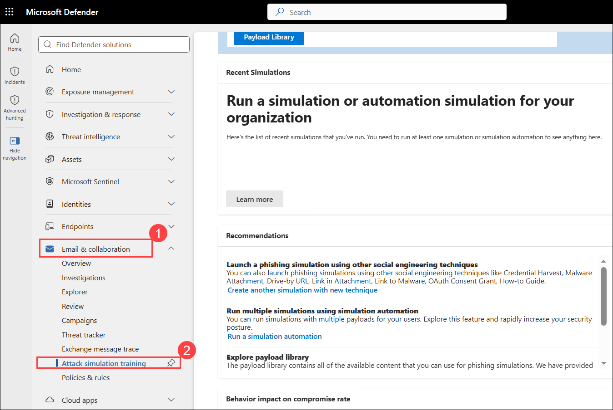

   > **Note:** If you do not see the **Attack simulation training** option under the **Email & collaboration** section in the Microsoft 365 Defender portal, skip this lab and the next lab (Lab 06 - Exercise 6) for now. The remaining labs are independent and can be completed without this feature. Once the **Attack simulation training** option becomes available in your tenant, you can return and complete these labs. If the option still doesn't appear after some time, please reach out to the CloudLabs support team at **cloudlabs-support@spektrasystems.com** for assistance.

1. On the **Attack simulation training** page, Holly has decided to conduct a simulated account breach in which she will use a URL to try and obtain usernames and passwords. This is referred to in the Attack Simulator as a **Credentials Harvest** attack.

   > **Note:** Notice the tabs that appear across the top of the **Attack simulation training** page (where the **Overview** tab is displayed by default).You can launch this attack either from **Simulations** tab by selecting the **+ Launch a simulation**. Since the **Overview** tab has additional information and is the default page when selecting the **Attack simulation training** service, it is recommended that you launch it from there so that you can learn about the specifics of this type of attack.

1. On the **Overview** tab, scroll down to the **Recommendations** section. Under the **Launch a phishing simulation using other social engineering techniques** recommendation, select **Create another simulation with new technique**. This initiates the **Create Simulation** wizard.

   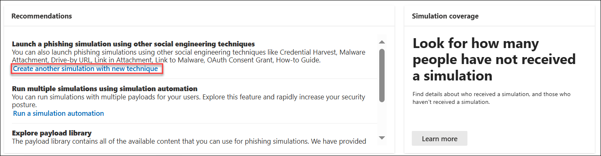

1. On the **Select technique** page, review the specific information related to the **Credentials Harvest (1)** attack type option and also select it. At the bottom of the **Credential Harvest** option, select the **View details of Credential harvest (2)** link. This opens a **Credential Harvest** pane on the right. Review the **Description** and the **Simulation steps** for this type of attack. When you're done, close the **Credential Harvest** pane.

   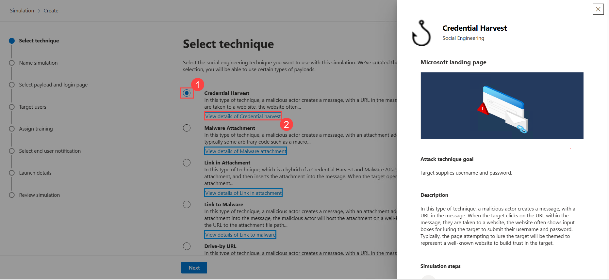

1. On the **Select Technique** page, select the **Credentials Harvest** attack type if it's not already selected by default, and then select **Next**.

1. In the **Simulation** wizard, the steps involved in the simulation are displayed in the left-hand pane. While you can manually create a phishing campaign, it is recommended that you take advantage of the available templates that will prefill most of the information for you. The key to a successful phishing attack is to create a very intriguing, real-world looking email, and the templates provide very creative solutions.

   On the **Name Simulation** page, provide the following information:
   - Simulation Name: **`PhishingTest1` (1)**
   - Description: **`This simulation provides insight on targeted email threats against users inside the company.` (2)**

1. Select **Next (3)**.

   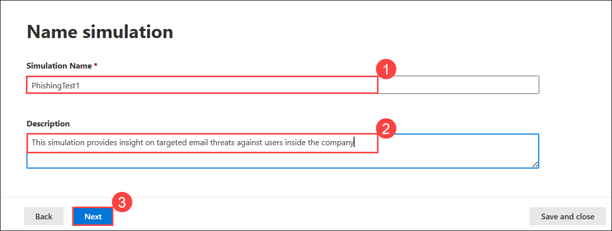

1. On the **Select payload and login page** window, select the check box to the left of the **Payment for Package (1)** payload. Select **Next (2)**.

   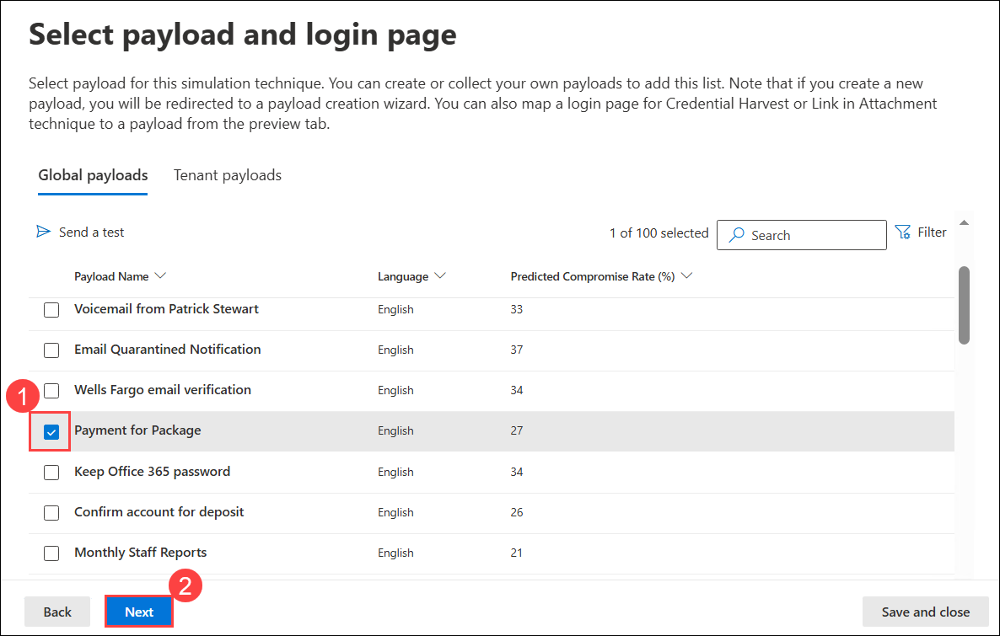

   > **Note:** If the Payment for Package payload does not appear, select another Payload of your choice. A payload is the link or attachment in the simulated phishing email message that's presented to users. In the real-world, you'd want to use a payload that works best for your organization.

1. On the **Target Users** page, select the **Include all users in my organization (1)** option. This will display all of Adatum's users. Select **Next (2)**, and then on the **Exclude users** page, select **Next** again.

   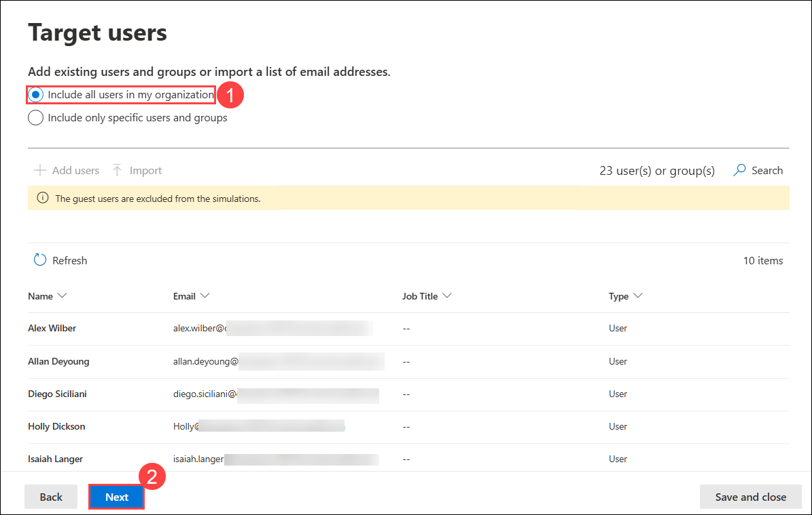

1. On the **Assign Training** page, under the **Preferences** section, the **Assign training for me (Recommended) (1)** option should be selected by default (if not, select it). Select the **Due Date** field. In the drop-down menu that appears, select **7 days after Simulation ends (2)** and then select **Next (3)**.

   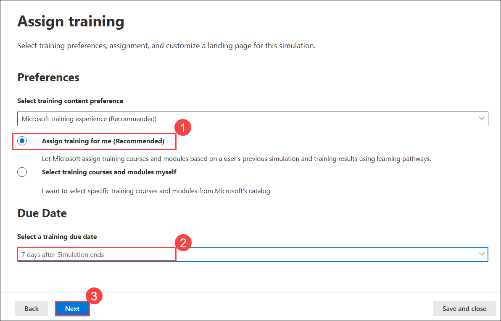

1. On the **Select Phish landing page** window, the **Global landing pages** tab should be displayed by default. This tab displays a list of predefined landing page templates. Select the **Microsoft Landing Page Template 1** name to preview the page.

1. A preview of the **Microsoft landing page** for this template appears in a new pane. This preview pane provides an example of what the landing page will look like when someone experiences a phishing attack and the simulation uses **Microsoft Landing Page Template 1**. Scroll down through this preview panel and review the features. When you're finished, select the **Close** button at the bottom of the preview pane.

   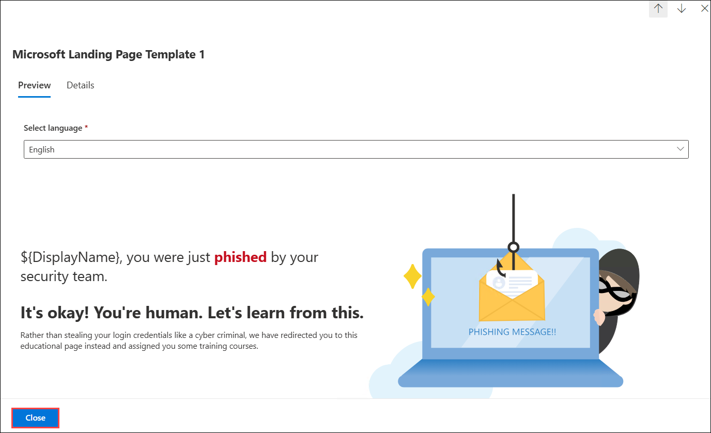

1. You will now look at some of the other landing page templates until you find one that you want to use for this simulation. On the **Select Phish landing page** window, select one of the other templates (select the name of the template and not its checkbox). Examine the preview pane and note how the landing page for this template is different from **Microsoft Landing Page Template 1**. When you're finished, select the **Close** button at the bottom of the preview pane.

1. Repeat the prior step and select another template. Note how this template is different from the other two you looked at.

1. Repeat this step as many times as you would like until you find a template that you want to use for this simulation. When you're finished reviewing templates, select the checkbox for the template that you want to use on the **Select Phish landing page** and then select **Next**.

   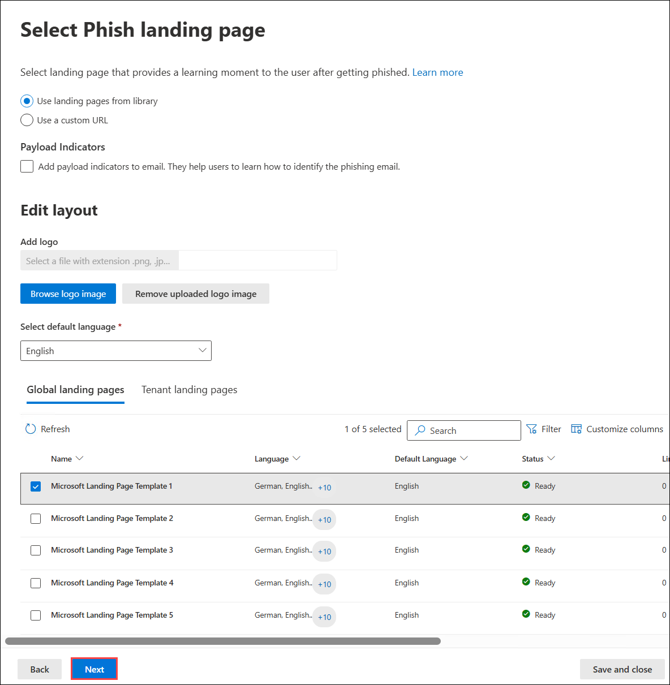

1. On the **Select end user notification** page, choose how you want the end user to be notified. For the purpose of this lab, select **Microsoft default notification (recommended) (1)**. In the list of notifications that appears, configure the following notifications:
   - Microsoft default positive reinforcement notification - set **Delivery preferences** to **Deliver after simulation ends (2)**
   - Microsoft default training reminder notification - set **Delivery preferences** to **Weekly (3)**

1. Select **Next (4)**.

   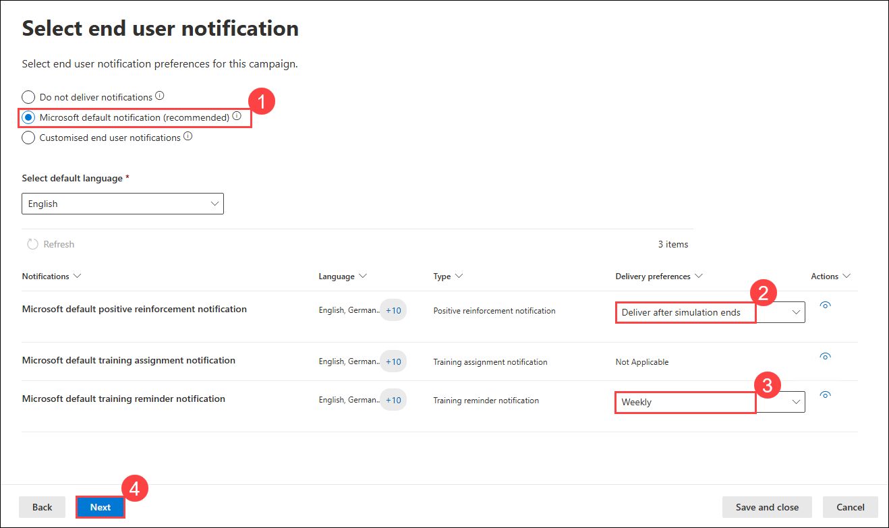

1. On the **Launch Details** page, select the **Launch this simulation as soon as I'm done (1)** option and then select **Next (2)**.

   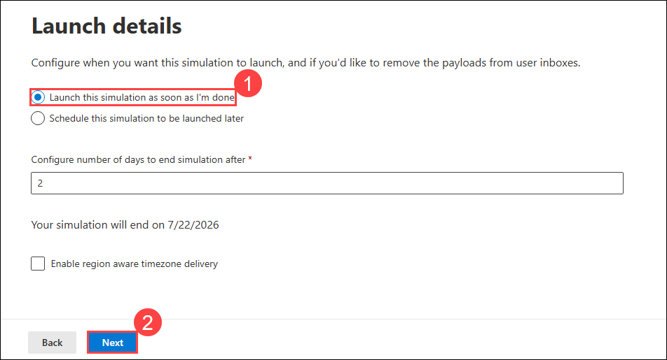

1. On the **Review Simulation** page, review the entered information. If anything needs to be changed, select the appropriate **Edit** option to make the change. Once everything is correct, select **Submit**. It may take a few minutes before you receive a confirmation stating **Simulation has been scheduled for launch**. Select **Done**.

   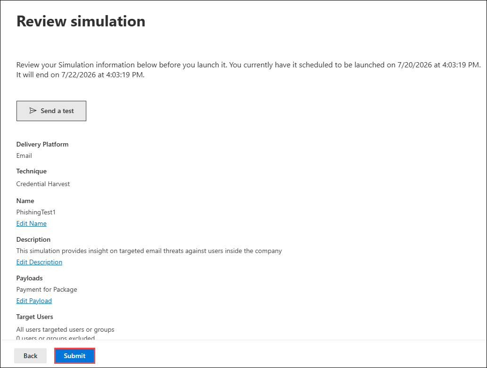

### Task 2: Review the attack simulation results

In this task, you will review the results of a previously run attack simulation to evaluate how users responded and to identify potential vulnerabilities or training needs within your organization.

1. Switch to **LON-CL2**, where you should be logged into the machine as the local **adatum\administrator** account.

1. In Lynne's Outlook Inbox, you should see the spear phishing email that was sent by the Attack Simulator. The subject of the message should be **Payment for Package**. Select the email to open it and review the details in the body of the message.

   > **NOTE:** It can take up to 15 minutes for the email to arrive. Wait for the email before proceeding. In the email, note the message that appears. Again, the message may vary depending on the payload you selected when setting up the spear phishing simulation. For example, it may say something like: **Our server has detected some errors delivering 2 new message to your Inbox due to the synchronization delay. Click on View Returned Messages below to retrieve these messages.** Regardless of the exact message, keep in mind that its purpose is to trick the user into thinking this is a legitimate email, when in fact, it's a spear phishing attack.

1. Select the **Pay Now** button in the email. Even though you know this is a spear phishing attack, this will enable you to see the effect of doing so in the Attack Simulator report that tracks the results of the spear phishing campaign.

   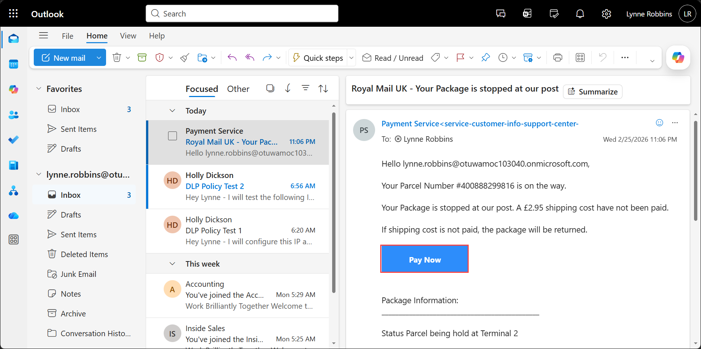

1. In the **Sign in** dialog box that appears, enter **lynne.robbins@otuwamoc101832.onmicrosoft.com**' as username, and then enter the password as **<inject key="AzureAdUserPassword"></inject>** in the **Enter password** window. Select **Sign in**.

1. This displays a web page that explains how you have been redirected to it as part of a Phishing awareness test being run by your organization. Read through the contents of this site, which uses the landing page template that you selected in the prior task when setting up the attack simulation.

   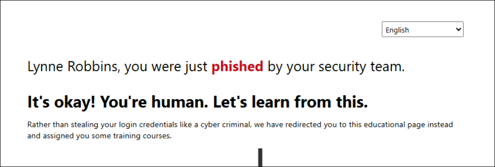

1. Leave the Outlook tab open for Lynne's mailbox in your Edge browser. Do **NOT** sign out or close it. You will access Lynne's mailbox on LON-CL2 in the next lab exercise.

1. Switch back to **LON-CL1**.

1. In LON-CL1, in your Edge browser session where you are logged in as Holly Dickson, you should still be on the **Attack simulation training** page. If the **PhishingTest1** simulation does not appear in the **Recent Simulations** list, select the **Refresh** icon to the left of the URL on the address bar. The **PhishingTest1** simulation should now appear. Select the **PhishingTest1** simulation to view the diagnostic results that were captured for this simulation.

   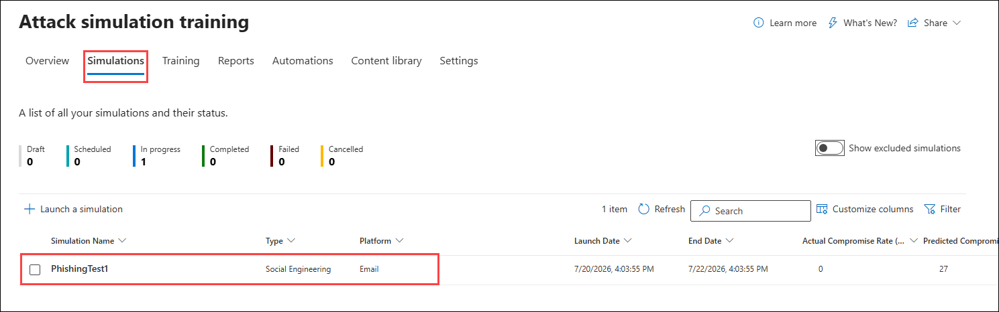

1. A **PhishingTest1** page should appear. Review all the information collected for this simulated attack. When you're finished, select the **X** in the upper right-hand corner of the window to close it.
   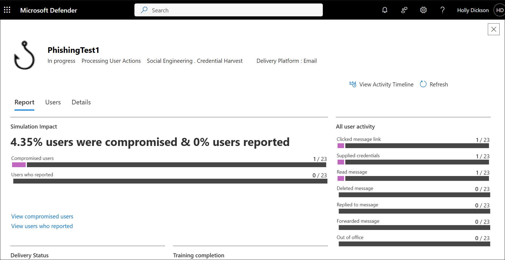

1. Leave your browser open in LON-CL1 and do not close any of the tabs.

## Review

In this lab, you have:

- Configured and launch a Spear Phishing attack.
- Reviewed the attack simulation results.

## The lab has been completed successfully. Click **Next >>** to proceed to the next exercise.

