# Lab 07 - Exercise 1: Configure In-place Archiving and Retention Policies

> **!IMPORTANT**: `Once you launch the track, you’ll have access to a virtual machine (VM) for 40 hours. The displayed track duration of 30 days indicates the time frame during which you can use your VM. Please plan your lab sessions accordingly. If the VM uptime of 40 hours is fully exhausted before completing the labs, access will be lost. To avoid this and for detailed instructions on VM usage and stopping/deallocating the VM, refer to the Getting Started page.`

> `If the full 40 hours of VM uptime is exhausted, the VM will no longer be accessible, and the lab duration cannot be extended.`

## Lab scenario

In this exercise, you will use the the Microsoft Exchange admin center to enable In-place archiving for Holly Dickson's mailbox. You will then configure two retention policies through the Microsoft Purview portal.

> **!IMPORTANT**: Once you launch the track, you’ll have access to a virtual machine (VM) for **40 hours**. The displayed track duration of **30 days** indicates the time frame during which you can use your VM. Please plan your lab sessions accordingly. If the VM uptime of **40 hours** is fully exhausted before completing the labs, access will be lost. To avoid this and for detailed instructions on VM usage and stopping/deallocating the VM, refer to the Getting Started page.

> If the full 40 hours of VM uptime is exhausted, the VM will no longer be accessible, and **the lab duration cannot be extended**.

### Task 1 – Activate In-Place Archiving for a new user's mailbox

In this task, you will enable In-Place Archiving for a newly created user to provide them with an archive mailbox for storing older or infrequently accessed emails.

1. On **LON-CL1**, in your Edge browser, you should still be logged into Microsoft 365 as **Holly Dickson**.

1. In Microsoft Edge, in the **Microsoft 365 admin center**, under the **Admin centers** group, select **Exchange** to open the Exchange admin center.

   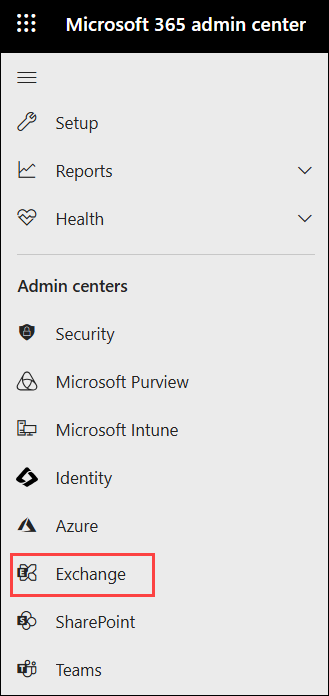

1. In the **Exchange admin center**, the **Manage mailboxes** page appears by default. Note the users who have an **Archive status** that is set to **Active**. These archive mailboxes were enabled when the VM lab environment was built for this training course and these users were preconfigured in the tenant. However, since you added Holly's user account in one of the first labs at the start of this course, her archive mailbox is **Disabled** by default.

1. To enable Holly’s archive mailbox, select **Holly Dickson** in the user list. In the **Holly Dickson** pane that appears, select the **Others** tab. In the **Mailbox archive** section, note that Holly's archive mailbox is disabled. In this group, select **Manage mailbox archive**.

   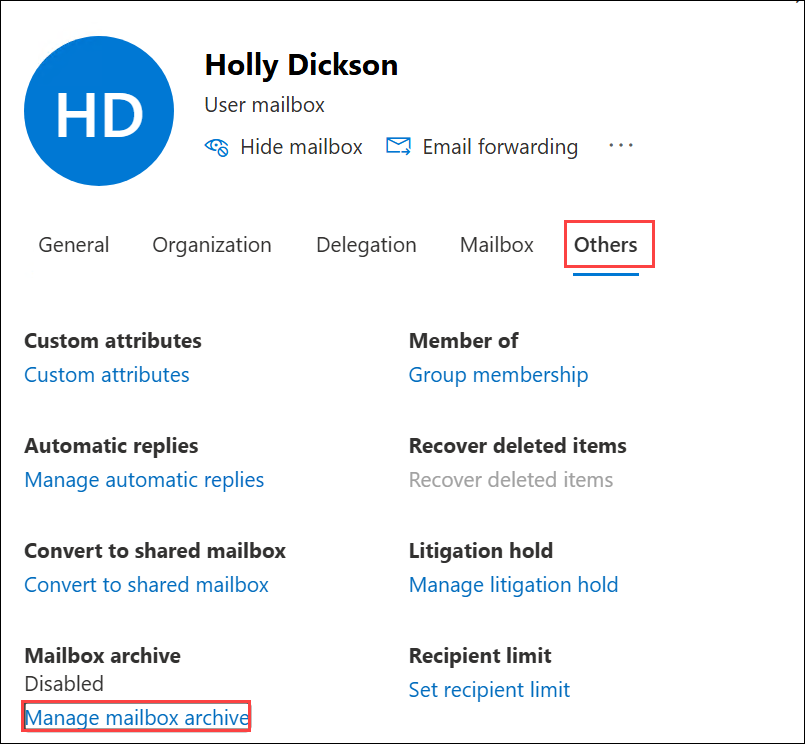

1. In the **Manage mailbox archive** pane that appears, select the toggle switch for **Mailbox archive status** to change it to **Enabled (1)**. Select **Save (2)** and then close the pane.

   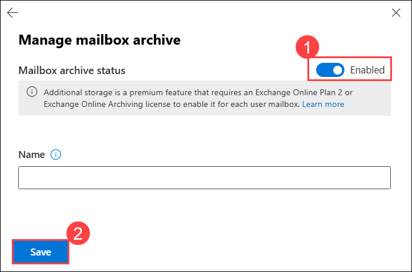

1. It might take a few moments to create Holly's archive mailbox. In the **Manage mailboxes** page, select the **Refresh** icon on the menu bar above the list of users. Holly's archive mailbox should now be **Active** once the archive mailbox is created. You may have to wait a minute or two and refresh again until **Active** appears.

   

1. In your Microsoft Edge browser, leave your Edge browser and all its tabs open for the next task.

### Task 2 – Create an email retention policy for test users

In this task, you will create a custom email retention policy and apply it to a group of test users to control how long emails are retained before being archived or deleted.

1. On **LON-CL1**, your Microsoft Edge browser should still have the **Microsoft 365 admin center** open. Select the tab for the **Microsoft 365 admin center**. In the left-hand navigation pane, under the **Admin centers** section, select **Microsoft Purview**. Doing so will open the **Microsoft Purview** portal.

   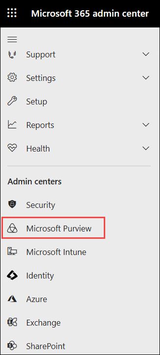

1. In the **Microsoft Purview** portal, in the left-hand navigation pane, select **Solutions (1)**, and then select **Data lifecycle management (2)**.

   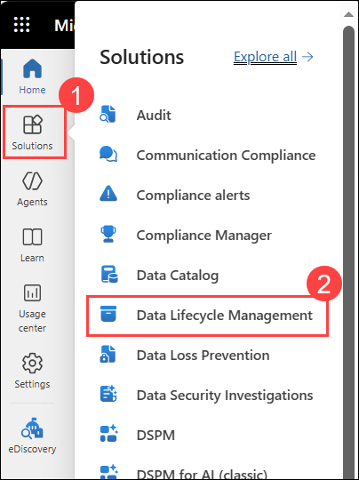

1. In the **Data lifecycle management** window, in the list of tabs expand **Policies (1)** and, select **Retention policies (2)**.

1. On the **Retention policies** tab, select **+ New retention policy (3)** on the menu bar. This initiates the **Create retention policy** wizard.

   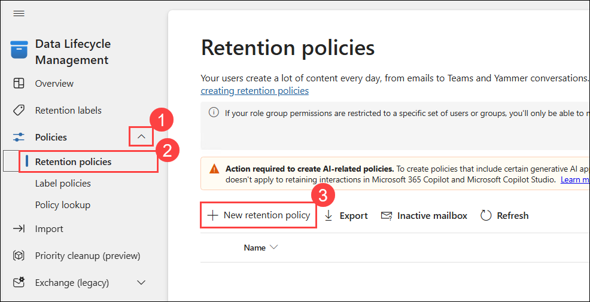

1. On the **Name your retention policy** page, enter **Test user email retention (1)** in the **Name** field and then select **Next (2)**.

   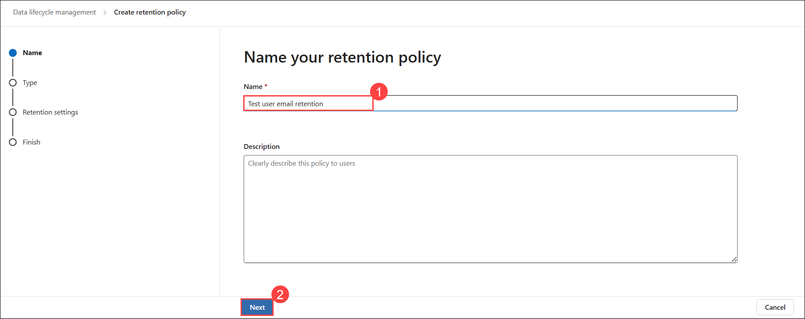

1. On the **Choose the type of retention policy to create** field, select **Static (1)** and then select **Next (2)**.

   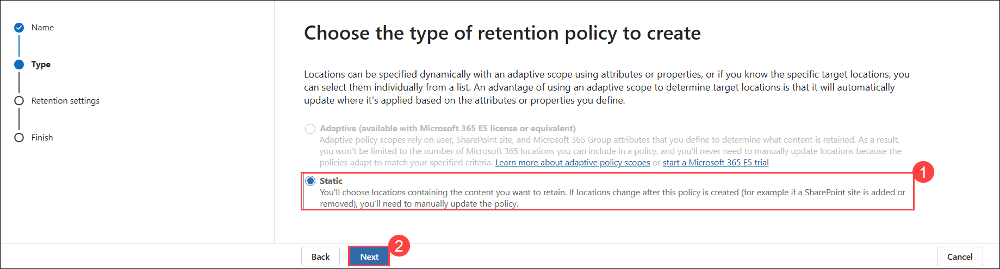

1. On the **Choose where to apply the policy** page, note the **Exchange mailboxes** location. It's currently set to include **All mailboxes**. You want to change this to just apply to Joni Sherman and Lynne Robbins' mailboxes. Under All mailboxes, select **Edit**.

   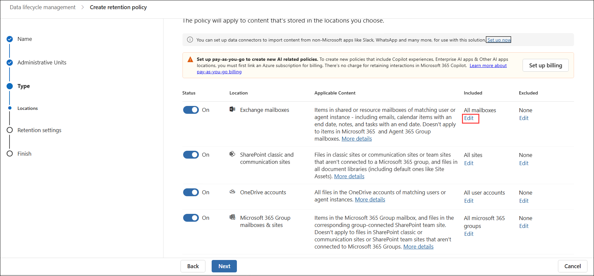

1. In the **Exchange mailboxes** pane that appears, hover your mouse over **Joni Sherman (1)** and then select her check box. Do the same for **Lynne Robins (2)**.

   > **Note:** If you select a user's name, the other check boxes that have been selected will be unselected. To select multiple users, you must hover your mouse over each user's name and select their check box that appears.

1. Once both check boxes are selected, select **Done (3)**.

   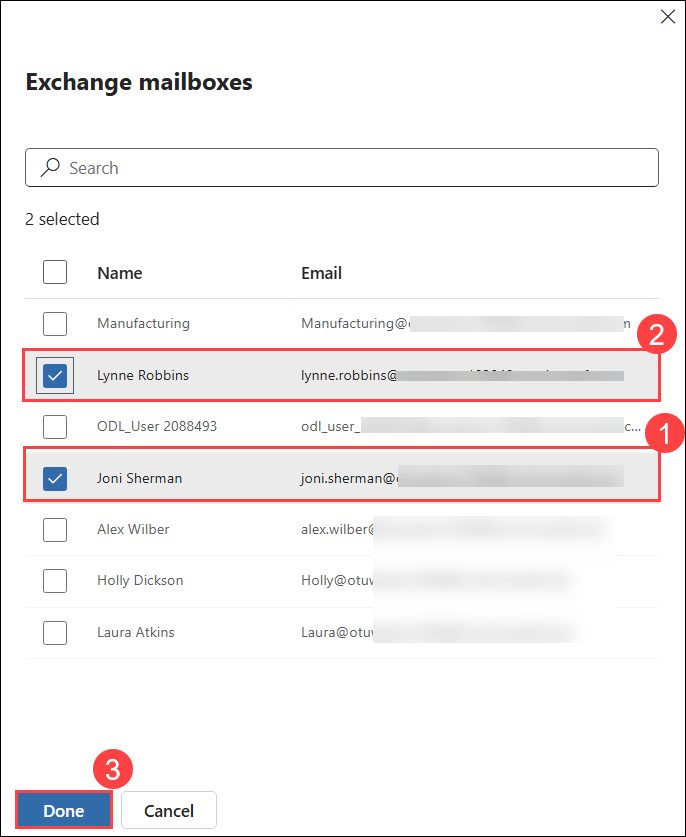

1. On the **Choose where to apply the policy** page, the **Exchange mailboxes** location should now indicate that **2 mailboxes (1)** are included. Since this policy will only apply to Exchange mailboxes for Joni and Lynne, set the **Status** toggle switch to **Off (2)** for all other locations in which it's currently set to On (**SharePoint classic and communcation sites, OneDrive accounts, and Microsoft 365 Group mailboxes & sites**). Select **Next (3)**.

   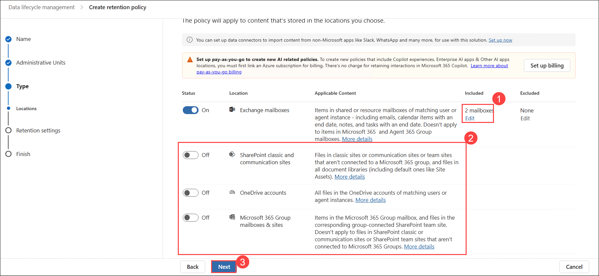

1. On the **Decide if you want to retain content, delete it, or both** page, verify the **Retain items for a specific period** option is selected (if necessary, select it now). Then enter the following information for this option:
   - Retain items for a specific period - select in this field, and in the drop-down menu that appears, select **Custom**. Three fields will appear - years, months, and days. For testing purposes, Holly wants to test email retention for emails in Joni and Lynne's mailboxes by only retaining emails that are less than one year old. As such, set the time periods to the following values: **Years - 1, Months - 0, Days - 0**.

   - Start the retention period based on - **When items were created**

   - At the end of the retention period - **Delete items automatically**

     

1. Select **Next**.

1. On the **Review and finish** page, review your selections. If anything needs to be changed, select the appropriate Edit link and make the necessary changes. Otherwise, if everything is correct, select **Submit**.

   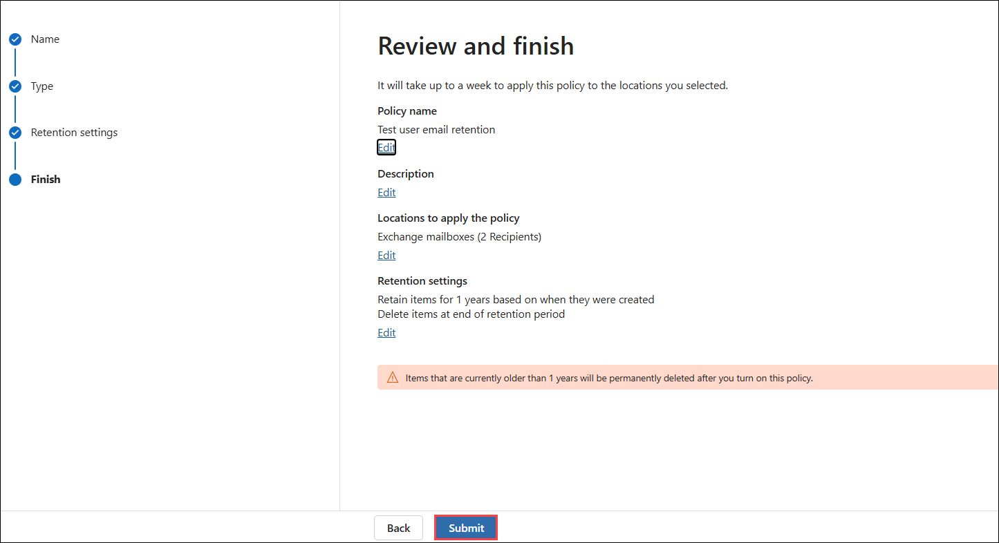

1. On the **You successfully created a retention policy** window, select **Done**.

   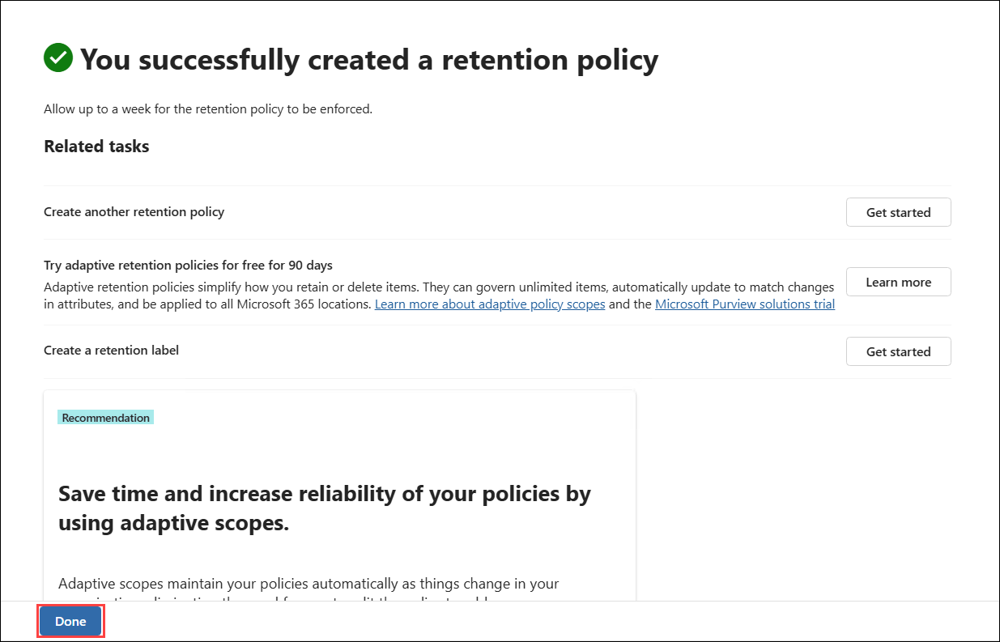

1. Leave the **Data lifecycle management** tab open in your Edge browser as you will create another retention policy in the next task.

### Task 3 – Create an email retention policy for all users

In this task, you will define and apply a global email retention policy that governs the email lifecycle for all users in the organization.

1. On **LON-CL1**, your Edge browser should still have the **Microsoft Purview** portal open from the prior task, and it should be displaying the **Data lifecycle management** window.

1. In the **Data lifecycle management** window, in the list of tabs that appear across the top of the page, select **Retention policies** (if another tab is selected).

1. On the **Retention policies** tab, select the check box next to **Test user email retention (1)**, and then select **Disable policy (2)** on the menu bar. Once the policy is disabled, a message will briefly appear at the top of the page indicating the policy is disabled. You can test this out by once again selecting the check box next to **Test user email retention**. Note that the menu bar includes an **Enable policy** option. This option indicates the policy is currently disabled. You can now proceed to the remaining steps in this task to create Adatum's official, organization-wide email retention policy.

   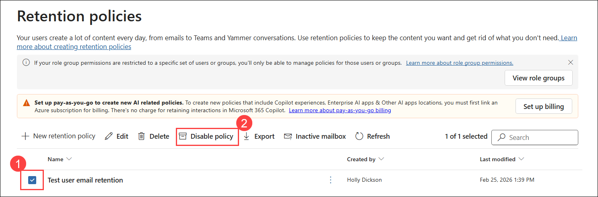

1. On the **Retention policies** tab, select **+ New retention policy** on the menu bar. This initiates the **Create retention policy** wizard.

1. On the **Name your retention policy** page, enter **Adatum email retention** in the **Name** field and then select **Next**.

1. On the **Choose the type of retention policy to create** field, select **Static** and then select **Next**.

1. On the **Choose where to apply the policy** page, this policy will only apply to **Exchange mailboxes**. Ensure that it's **Status** is set to **On**. Set the **Status** toggle switch to **Off** for all other locations that are turned **On** by default. **Exchange mailboxes** should be the only location whose **Status** is set to **On**.

1. For the **Exchange mailboxes** location, note that it's currently set to include **All mailboxes**. Do not change this value, since you want this policy to apply to all user mailboxes. Select **Next**.

   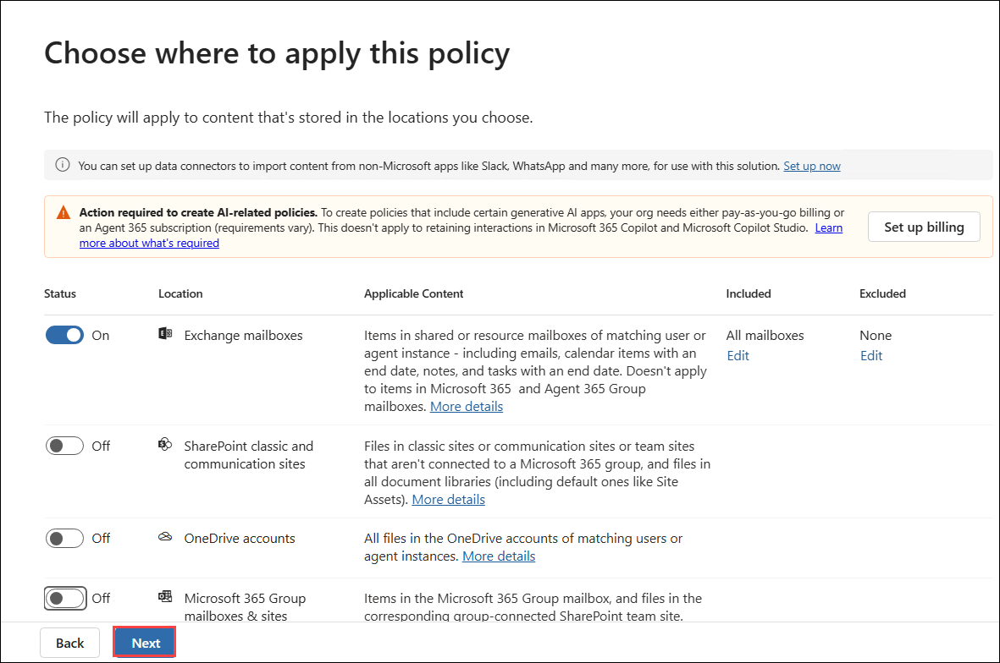

1. On the **Decide if you want to retain content, delete it, or both** page, verify the **Retain items for a specific period** option is selected (if necessary, select it now). Then enter the following information for this option:
   - Retain items for a specific period - **5 years (1)**

   - Start the retention period based on - **When items were last modified (2)**

   - At the end of the retention period - **Delete items automatically (3)**

1. Select **Next (4)**.

   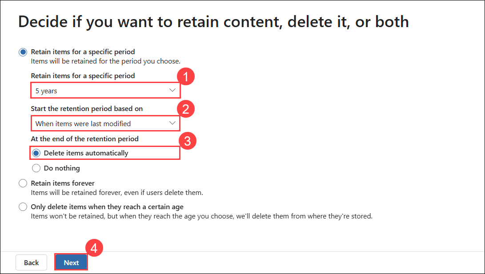

1. On the **Review and finish** page, review your selections. If anything needs to be changed, select the appropriate Edit link and make the necessary changes. Otherwise, if everything is correct, select **Submit**.

   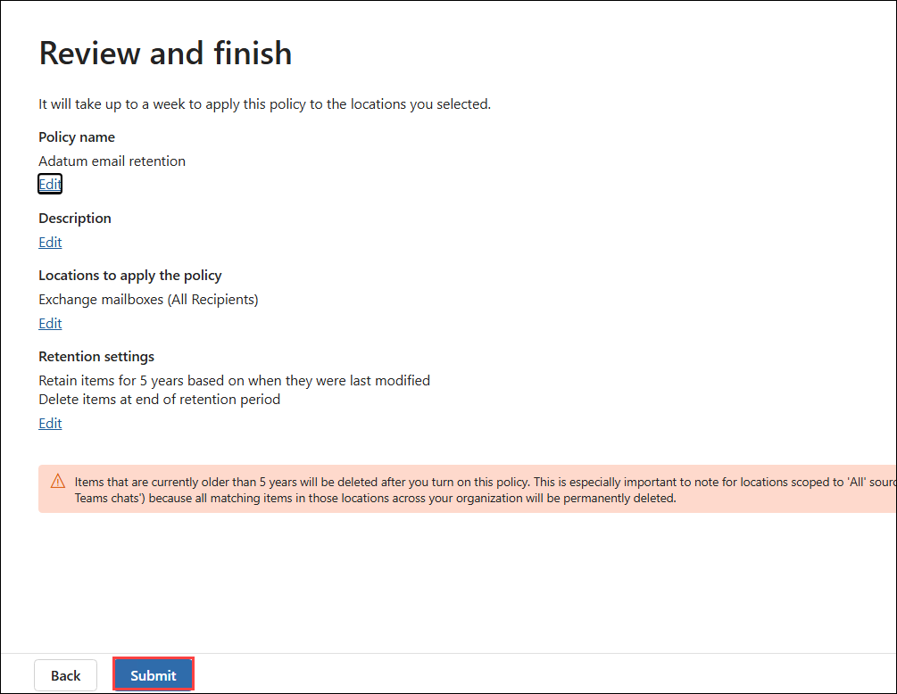

1. On the **You successfully created a retention policy** window, select **Done**.

1. In your Edge browser, leave all the tabs open as you proceed to the next exercise.

You have now created a new retention policy in the Microsoft Purview portal that retains all Exchange emails from all mailboxes for 5 years after the last modification.

## Review

In this lab, you have:

- Activated In-Place Archiving for a new user's mailbox.
- Created an email retention policy for test users.
- Created an email retention policy for all users.

## The lab has been completed successfully. Click **Next >>** to proceed to the next exercise.

