# Lab 08 - Exercise 1: Manage DLP Policies

> **!IMPORTANT**: `Once you launch the track, you’ll have access to a virtual machine (VM) for 40 hours. The displayed track duration of 30 days indicates the time frame during which you can use your VM. Please plan your lab sessions accordingly. If the VM uptime of 40 hours is fully exhausted before completing the labs, access will be lost. To avoid this and for detailed instructions on VM usage and stopping/deallocating the VM, refer to the Getting Started page.`

> `If the full 40 hours of VM uptime is exhausted, the VM will no longer be accessible, and the lab duration cannot be extended.`

## Lab scenario

In your role as Holly Dickson, Adatum’s new Microsoft 365 Administrator, you have Microsoft 365 deployed in a virtualized lab environment. As you proceed with your Microsoft 365 pilot project, your next steps are to implement Data Loss Prevention (DLP) policies at Adatum. You will begin by creating a custom DLP policy in this exercise, and then you’ll test DLP policies related to email message archiving and emails with sensitive data.

> **!IMPORTANT**: Once you launch the track, you’ll have access to a virtual machine (VM) for **40 hours**. The displayed track duration of **30 days** indicates the time frame during which you can use your VM. Please plan your lab sessions accordingly. If the VM uptime of **40 hours** is fully exhausted before completing the labs, access will be lost. To avoid this and for detailed instructions on VM usage and stopping/deallocating the VM, refer to the Getting Started page.

> If the full 40 hours of VM uptime is exhausted, the VM will no longer be accessible, and **the lab duration cannot be extended**.

### Task 1 – Create a DLP policy with custom settings

In this task, you will create a Data Loss Prevention (DLP) policy using custom settings to protect sensitive information by defining specific rules and actions that meet your organization's compliance requirements.

1. On **LON-CL1**, in your Edge browser, you should still be logged into Microsoft 365 as **Holly Dickson**.

1. In **Microsoft Edge**, the Microsoft Purview portal should still be open; if not, then open a new tab and navigate to **https://purview.microsoft.com**.

   > **Note:** if prompted to switch to the new Compliance portal, click on switch to new portal.

1. In the **Microsoft Purview** portal, in the left-hand navigation pane, select **Solutions (1)** then select **Data loss prevention (2)**, and select .

   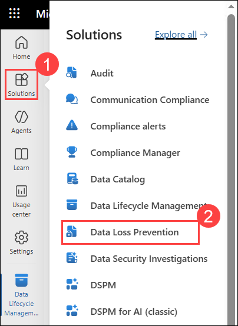

1. Now select **Policies (1)** and in the **Policies** page, select the **+ Create policy (2)** option on the menu bar to start the **Create policy** wizard.

   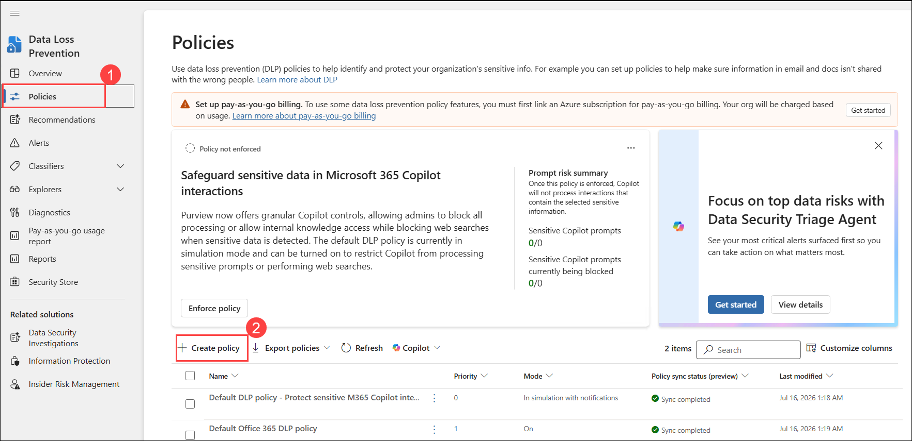

1. On the **Choose what type of data to protect** page, select **Enterprise applications & devices**.

   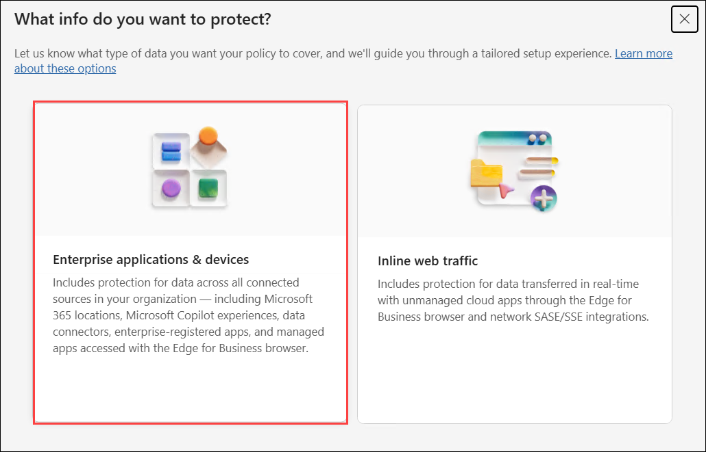

1. On the **Start with a template or create a custom policy** page, the **Categories** column displays the policy categories. Each policy category provide Regulations that can be used to create that type of policy, except for the **Custom** category. This category does not provide any specific template; instead, it enables organizations to create custom policies from scratch. When you select a category, **Regulations** column appears that displays the available Regulations to choose from for the selected category. When you select a template, another column appears that displays the type of information that is protected in that template.

1. For example, select **Financial** in the side pane and then scroll through the various Regulations that you can choose from in the **Regulations** column. Select one or two of the Regulations to see what type of information it protects. If you want, select each of the remaining categories to see what type of Regulations are provided.

1. For the purpose of this lab, you will create a custom DLP policy. Select **Custom** in the **Categories (1)** column, select the **Custom policy (2)** template in the **Regulations** column, and then select **Next (3)**.

   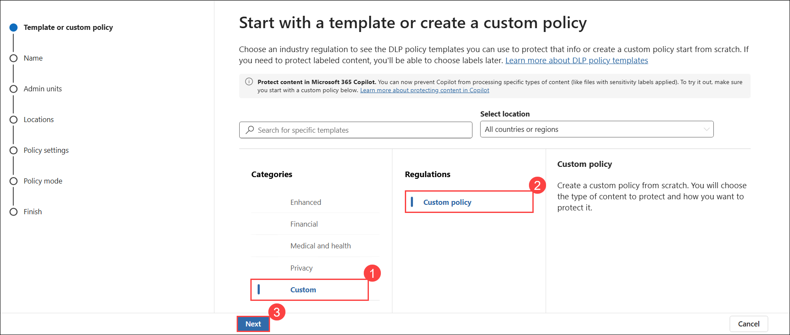

1. In the **Name your DLP policy** page, enter the following information and then select **Next (3)**:
   - **Name:** Replace the default name with **IP Address DLP policy (1)**

   - **Description:** Replace the default description with **This policy detects the presence of IP addresses in emails. End users are notified of the detection and admins receive a notification. Emails with 2 or more IP addresses are blocked from being sent. (2)**

     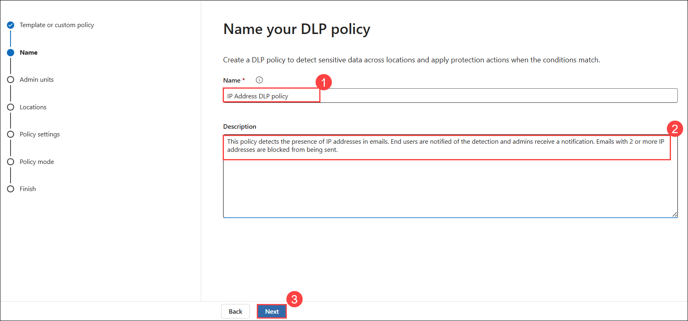

1. On the **Assign admin units** page, select **Next**.

1. On the **Choose where to assign the policy** page, verify the Checkbox is selected for the following locations (if any of these locations is not set to selected by default, then add them now):
   - **Exchange email**
   - **SharePoint sites**
   - **OneDrive accounts**
   - **Teams chats and channel messages**
   - Set all other locations to **Off** by unchecking them, and then select **Next**.

     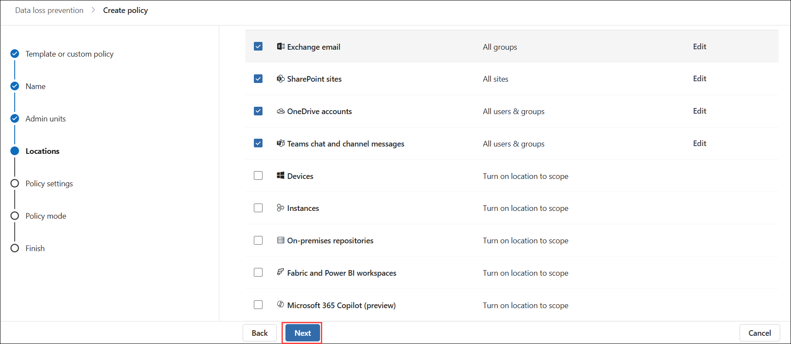

1. On the **Define policy settings** page, the **Create or customize advanced DLP rules** option should be set by default (if it isn't already selected by default, then select it now) and then select **Next**.

   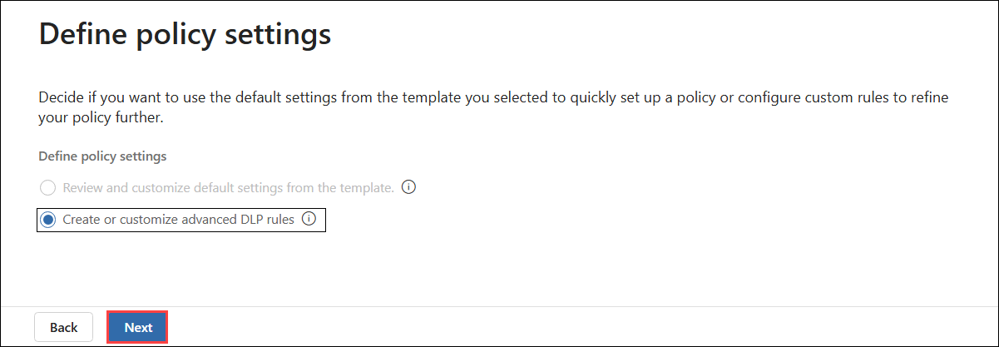

1. On the **Customize advanced DLP rules** page, select the **+ Create rule** option on the menu bar.

   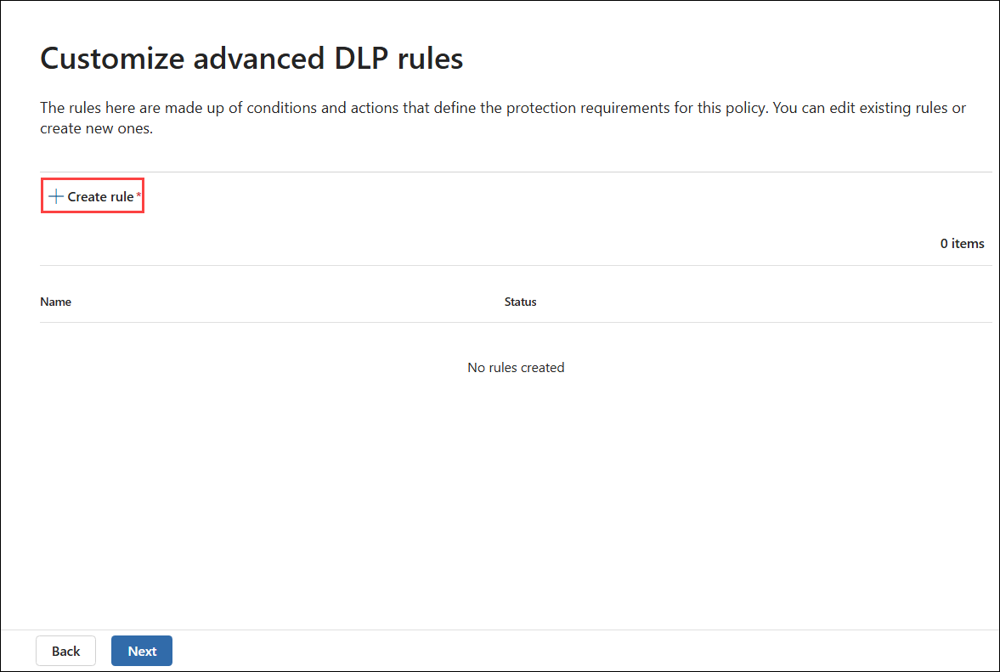

1. On the **Create rule** page, enter the following information:
   - Name: **Single IP Address rule (1)**
   - Description: **Email contains an IP address (2)**
   - In the **Conditions** section, select **+ Add condition (3)** and then select **Content contains (4)** from the drop-down menu that appears. Then enter the following condition settings:

     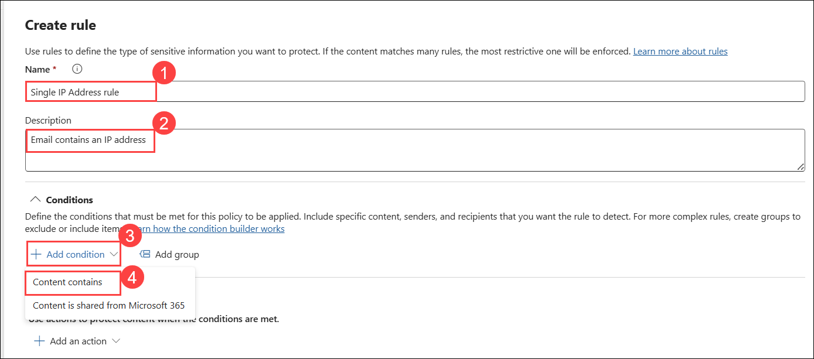
     - In the **Content contains** field, select the **Add (5)** drop-down menu and then select **Sensitive info types (6)**.

       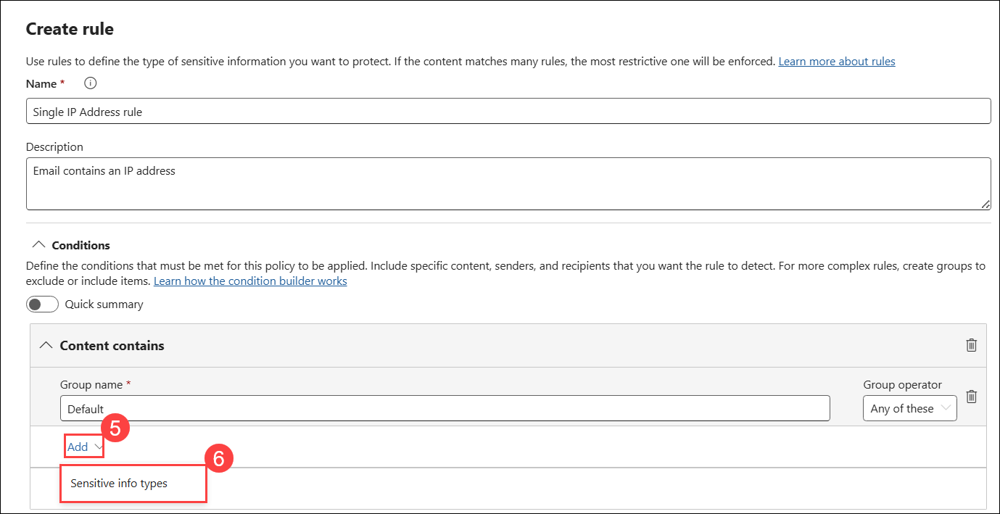

     - In the **Sensitive info types** pane, type **IP (7)** inside the **Search** field and then hit Enter.
     - In the search results, select the **IP Address (8)** check box and then select **Add (9)**.

       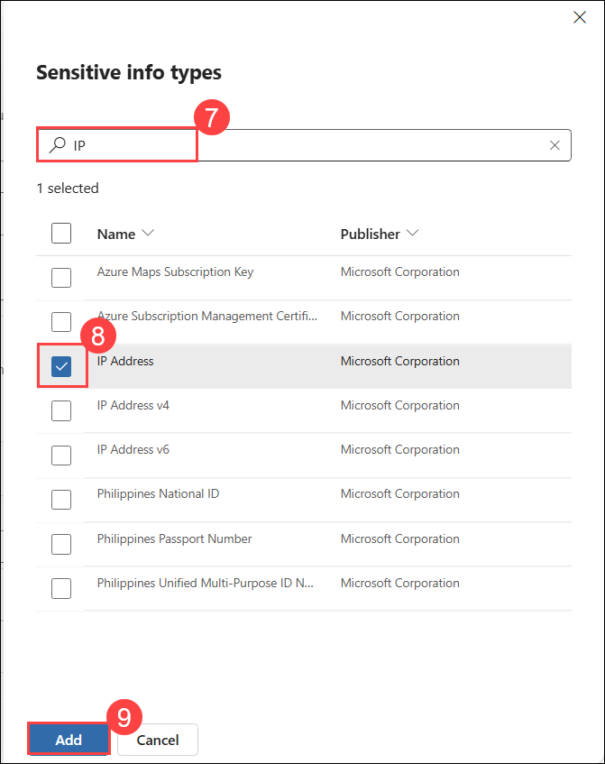

   - Scroll down to the **User notifications** section, set the **Use notifications to inform your users and help educate them on the proper use of sensitive info** toggle switch to **On**.

     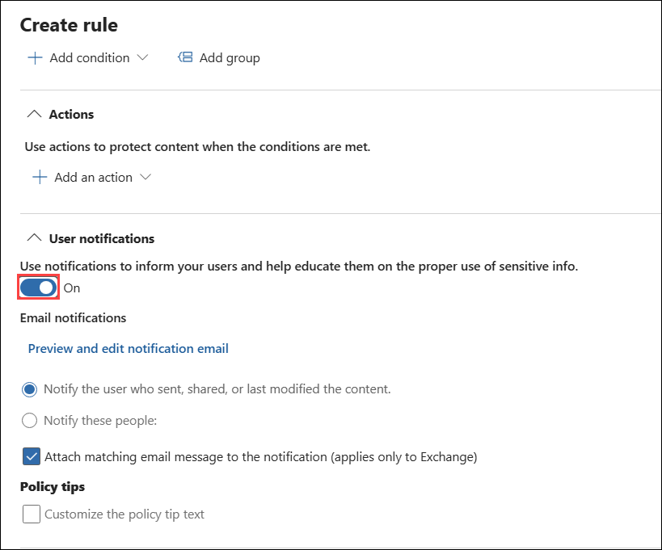

   - Select the **Notify users in Office 365 service with a policy tip checkbox**. In the Policy tips section, select the **Customize the policy tip text (1)** check box.
     - Holly wants you to customize the Policy Tip message. Enter the following text in this field: **ATTENTION! You have entered sensitive information (an IP address) in this message. You will not be prevented from sending this message, but please review whether the recipients are authorized to see this sensitive data. (2)**

       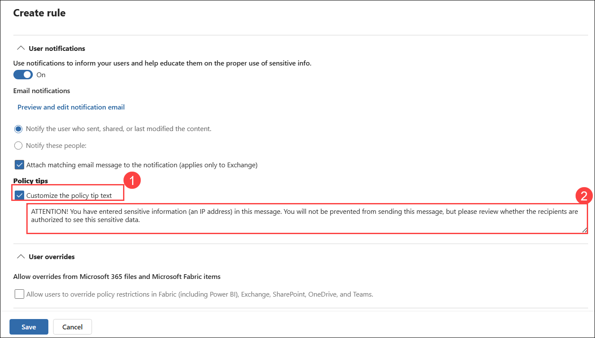

   - In the **Incident reports** section, verify the **Send an alert to admins when a rule match occurs** toggle switch is set to **On (1)** (if necessary, set it to **On**)

   - Select the **Save (2)** button at the bottom of the page.

     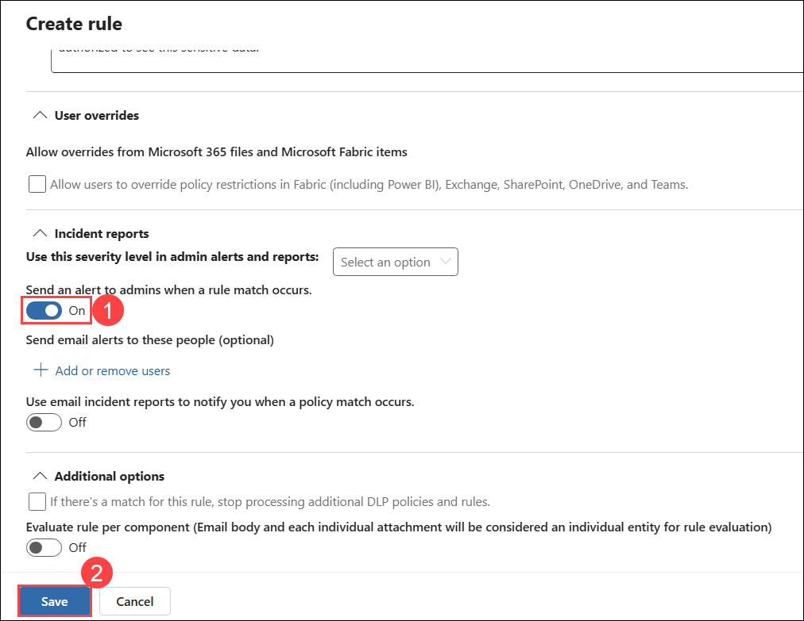

1. On the **Customize advanced DLP rules** page, the **Single IP Address rule** that you just created should now appear. Select the **+ Create rule** option to create the second DLP rule.

   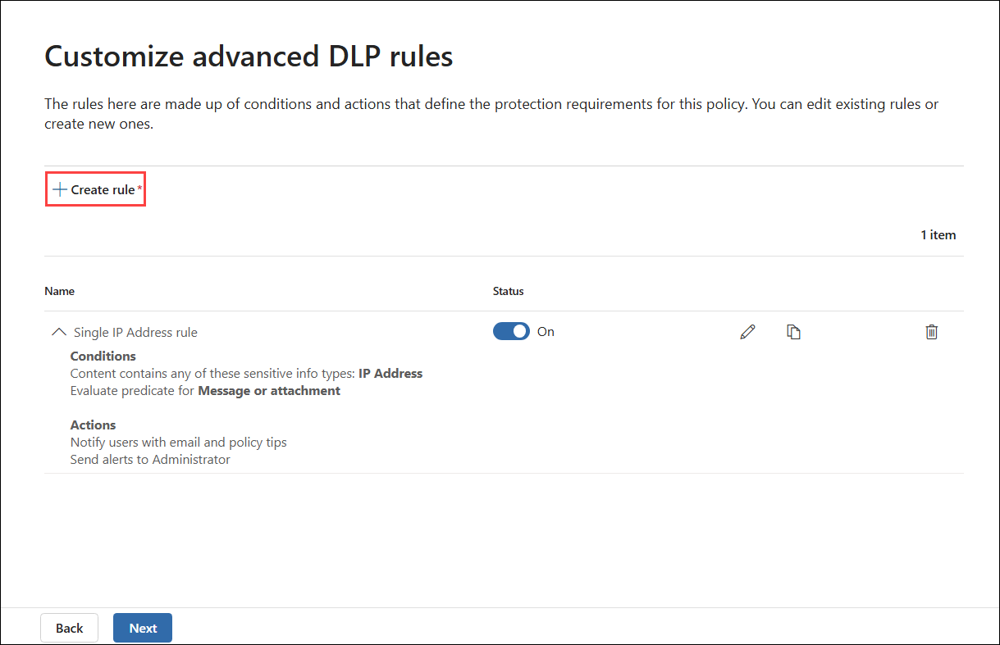

1. On the **Create rule** page, enter the following information:
   - Name: **Multiple IP Address rule**
   - Description: **Email contains two or more IP addresses**
   - In the **Conditions** section, select **+ Add condition** and then select **Content contains** from the drop-down menu that appears. Then enter the following condition settings:
     - In the **Content contains** field, select the **Add** drop-down menu and then select **Sensitive info types**.
     - In the **Sensitive info types** pane, type **IP** inside the **Search** field and then hit Enter.
     - Select the **IP Address** check box and then select **Add**.

     - Under the **Sensitive Info types** section, the **IP Address** info type is displayed. On the right side of the IP Address row, the **Instance count** setting is set from **1** to **Any**. Change the value of the first field from **1** to **2**. By making this change, this rule will only apply if 2 or more IP addresses appear in the email.

       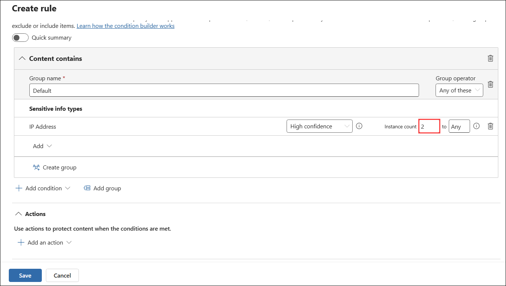

   - In the **Actions** section, select **+ Add an action (1)**. In the drop-down menu that appears, select **Restrict access or encrypt the content in Microsoft 365 locations (2)**. Then enter the following action settings:

     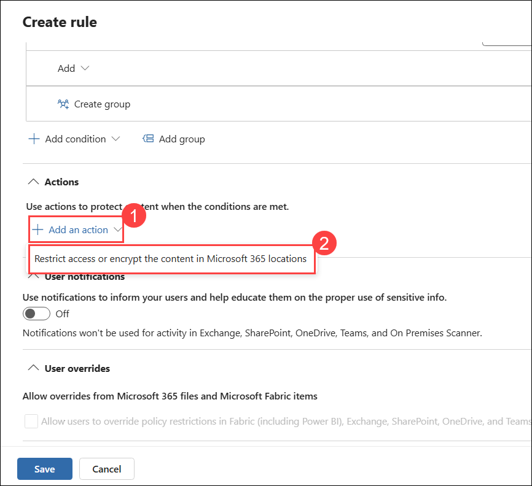
     - If no options appear under the **Restrict access or encrypt the content in Microsoft 365 locations** section, then select it now to expand this section. This section should display the **Block users from receiving email or accessing shared SharePoint, OneDrive, and Teams files** option, which is selected by default. Keep this option selected.

     - Under the **Block users from receiving email or accessing shared SharePoint, OneDrive, and Teams files** option, select the **Block everyone (3)** option.

       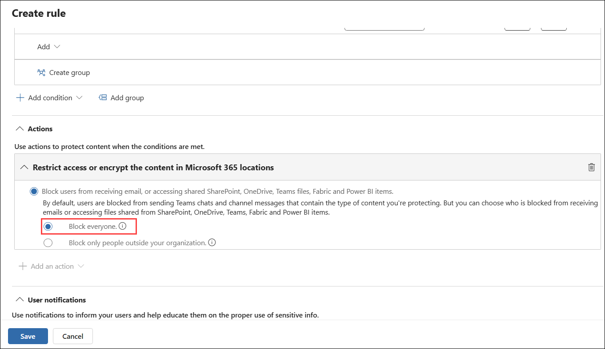

   - In the **User notifications** section, set the **Use notifications to inform your users and help educate them on the proper use of sensitive info** toggle switch to **On (1)**.

   - Select the **Notify users in Office 365 service with a policy tip checkbox**. In the Policy tips section, select the **Customize the policy tip text (2)** check box.
     - Enter the following text in this field: **ATTENTION! You have entered sensitive information (multiple IP addresses) in this message. You will be blocked if you attempt to send this message. Overriding this block indicates you have authorized sending this sensitive data to the recipients. (3)**

       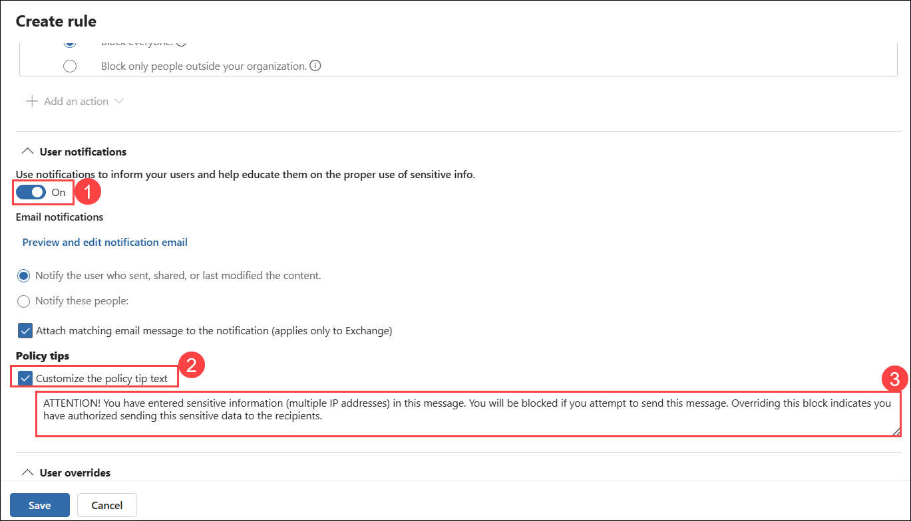

   - In the **User overrides** section, select the **Allow overrides from Microsoft 365 files and Microsoft Fabric items (1)** check box. This enables additional settings that indicate how overrides will be handled. Select each of the check boxes **(2)** for the following two options:
     - **Require a business justification to override**
     - **Override the rule automatically if they report it as a false positive**

   - In the **Incident reports** section, verify the **Send an alert to admins when a rule match occurs** toggle switch is set to **On (3)** (if necessary, set it to **On**).

   - Select the **Save (4)** button at the bottom of the page.

     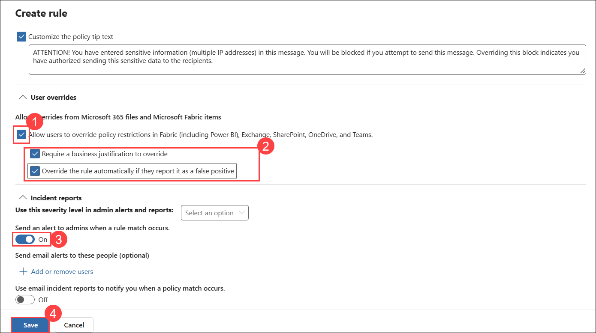

1. On the **Customize advanced DLP rules** page, both the **Single IP Address rule** and **Multiple IP Address rule** should now appear. Select **Next**.

   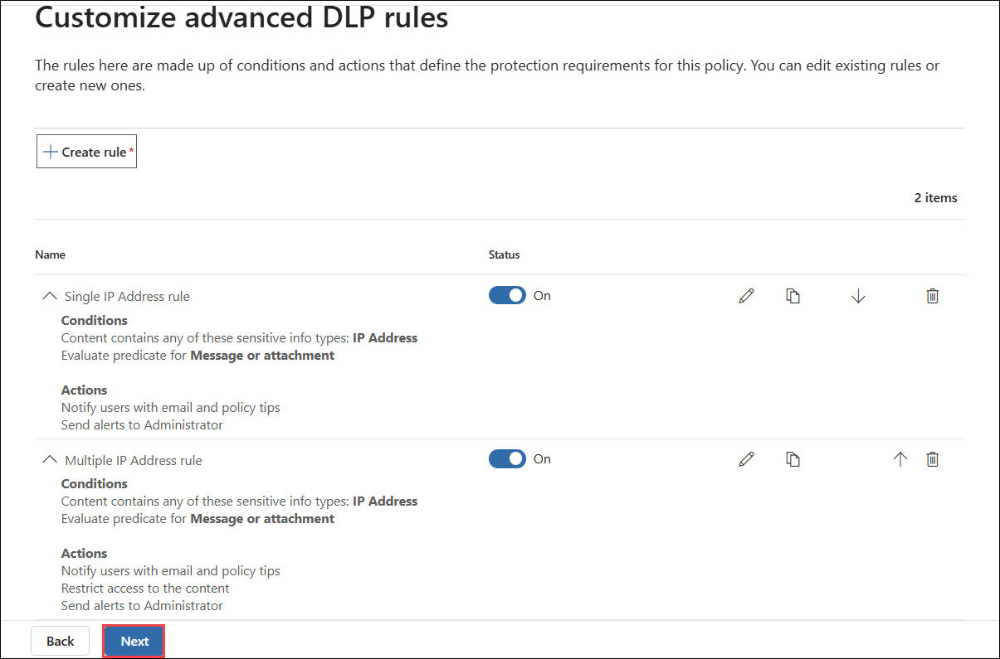

1. On the **Policy mode** page, select the **Turn the policy on immediately (1)** option and then select **Next (2)**.

   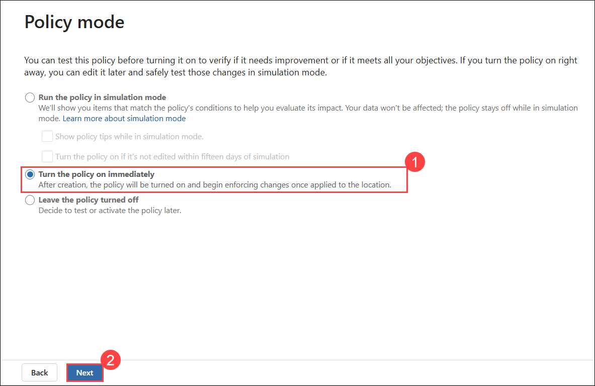

1. On the **Review your policy and create it** page, review the policy that you just created. If anything needs to be corrected, select the appropriate **Edit** option and make your corrections. When everything appears OK, select **Submit**.

   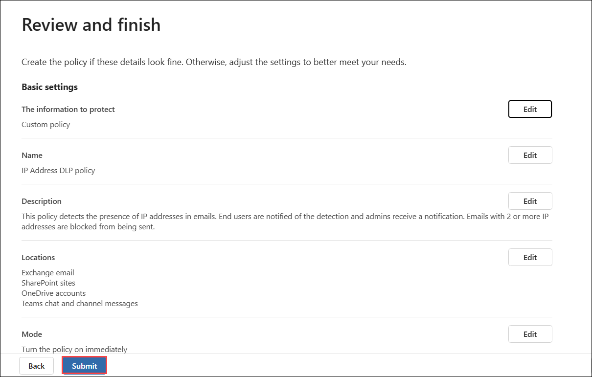

1. it may take a minute or so for the **New policy created** page to appear. When it does, select **Done**.

   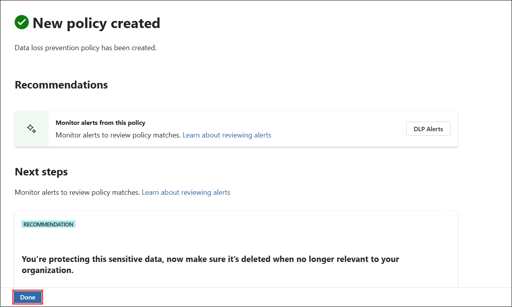

You have now created a DLP policy that scans for IP addresses in emails and documents that are sent or shared in your organization.

### Task 2 – Turn off the Send to Kindle feature that bypasses DLP policies

In this task, you will create a configuration policy in the Microsoft Intune admin center to disable the **Send to Kindle** feature in Microsoft Word. This feature allows users to send documents directly to their Kindle library, which can bypass Data Loss Prevention (DLP) controls. By adding and enabling the **Turn off Send to Kindle** setting in an Intune policy, you ensure that this feature is turned off across the organization, preventing users from transferring sensitive files to external locations that DLP policies cannot monitor.

1. On LON-CL1, in your Edge browser, you should still be logged into Microsoft 365 as **Holly Dickson**.

2. In your Edge browser, locate the **Microsoft 365 admin center** tab. In the Microsoft 365 admin center's navigation pane, under the **Admin centers** group, select **Microsoft Intune**.

   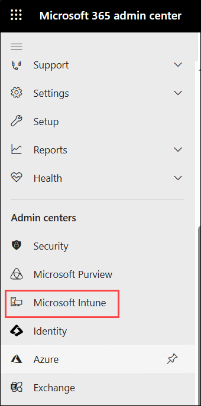

3. In the Microsoft Intune admin center, in the left-hand navigation pane, select **Apps (1)**, and then select P**olicies for Microsoft 365 apps (2)**. On the Apps | Policy configurations page, select the **Microsoft 365 Apps admin center (3)** link to open the **Microsoft 365 Apps admin center** in a new tab.

   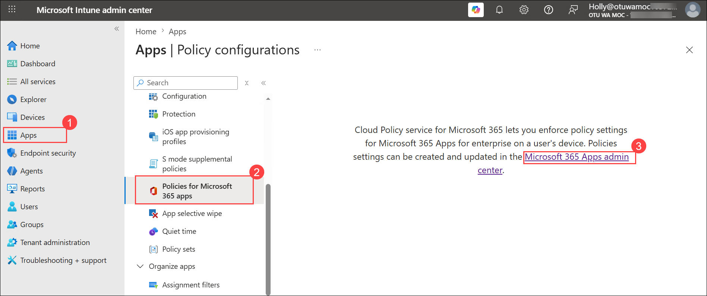

4. In the **Microsoft 365 Apps admin center**, in the left-hand navigation pane, select **Customization (1)**, and then select **Policy Management (2)**. On the Policy configurations page, select the **Create (3)** button. This initiates the wizard to create a new policy.

   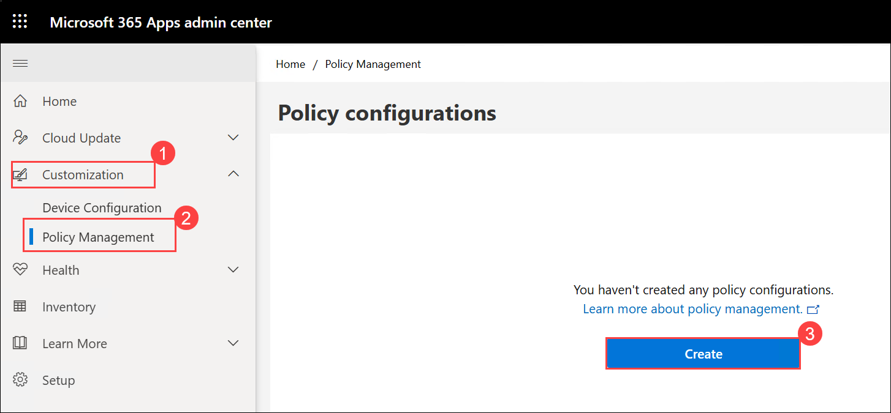

5. On the **Start with the basics** page, enter **Turn off Send to Kindle setting (1)** in the **Name** field and then select **Next (2)**.

   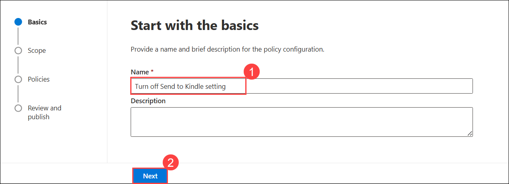

6. On the **Choose the scope** page, select the **This policy configuration applies to all users (1)** option and then select **Next (2)**.

   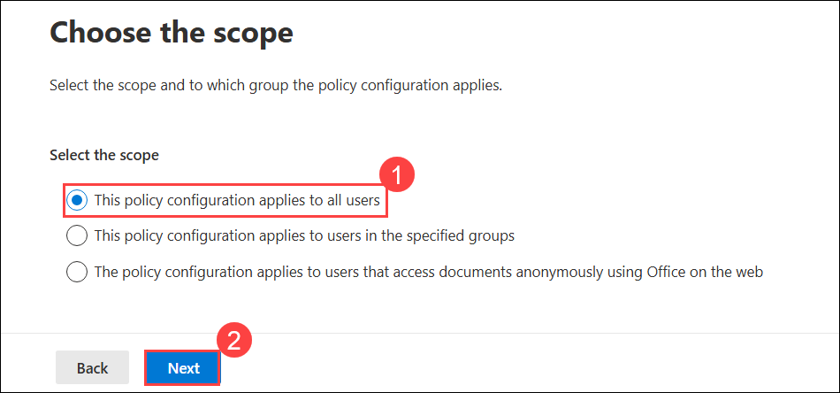

7. On the **Configure Settings** page, note the metrics that are displayed above the list of settings. There are over 2300 Office app settings for your tenant configuration. To quickly locate this setting, enter **Kindle** in the **Search (1)** field and then press **Enter**. This should display any policies with **Kindle** in the policy name.

8. As you can see, there's only one Kindle setting, which is **Turn off Send to Kindle (2)**. Select this setting, which opens the **Turn off Send to Kindle** pane.

   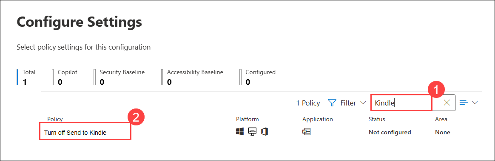

9. In the **Turn off Send to Kindle** pane, the plaforms and applications that this setting applies to are displayed. Under the the description, select the **Show more** option. Finish reading the complete description of this setting.

10. Select the drop-down arrow in the **Configuration setting** field. In the drop-down menu that appears, select **Enabled (1)**.

11. At the bottom of the pane, select the **Apply (2)** button.

    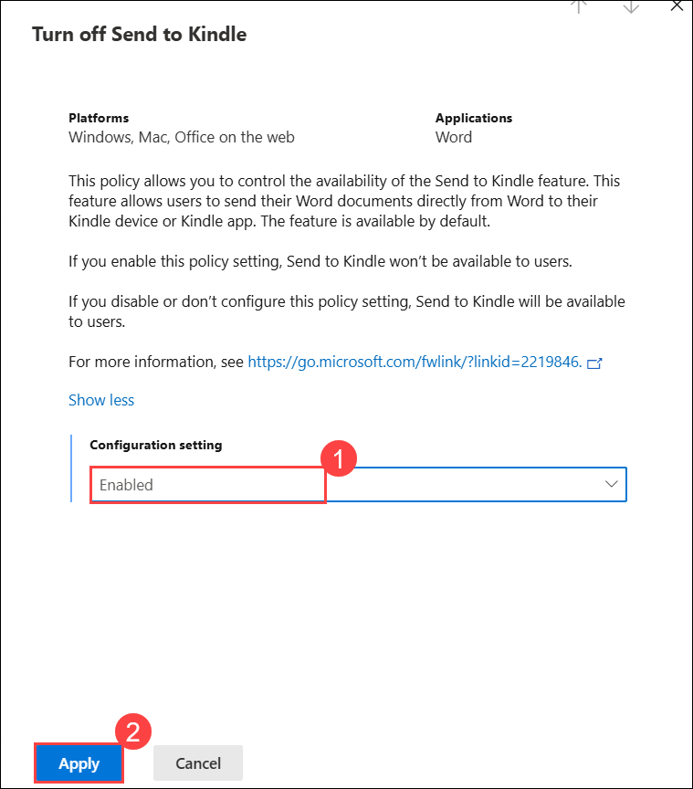

12. On the **Configure Settings** page, the **Turn off Send to Kindle** policy should appear, and its **Status** should be set to **Configured**. Select **Next**.

    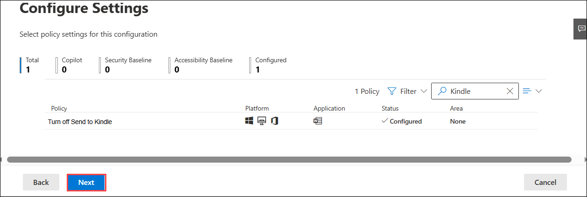

13. On the **Review configuration and create** page, select the **Create** button.

    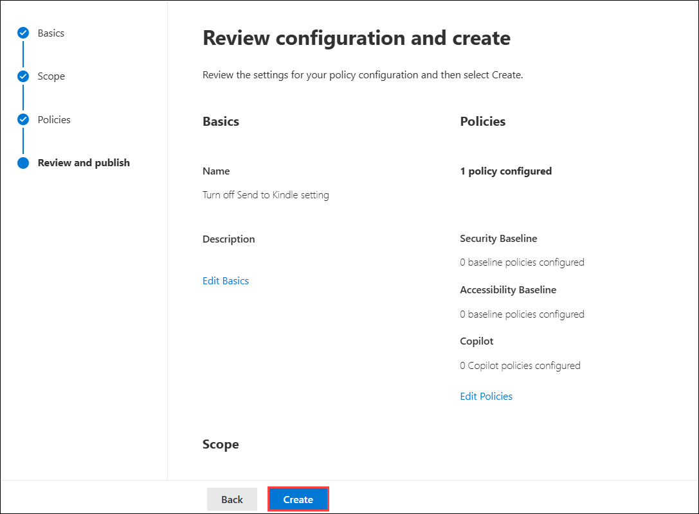

14. On the **Policy configuration created** page, select **Done**.

15. Leave your Edge browser open. Do not close any of the tabs.

By enabling this **Turn off Send to Kindle** setting in the new policy that you just created, you have turned off the **Send to Kindle** feature. This will prevent Adatum users from sending Word documents to their Kindle library, which bypasses the company's DLP policies.

## Review

In this lab, you have:

- Created a DLP policy with custom settings.
- Turn off the Send to Kindle feature that bypasses DLP policies

## The lab has been completed successfully. Click **Next >>** to proceed to the next exercise.

