# Getting Started with Your MS-102 : MICROSOFT 365 ADMINISTRATOR AND ESSENTIALS Workshop
 
Welcome to your MS-102 : MICROSOFT 365 ADMINISTRATOR AND ESSENTIALS workshop! We've prepared a seamless environment for you to explore and learn about key elements of Microsoft 365 administration: Microsoft 365 tenant management, Microsoft 365 identity synchronization, and Microsoft 365 security and compliance. Let's begin by making the most of this experience:

>**!IMPORTANT:** `Once you launch the track, you’ll have access to a virtual machine (VM) for 40 hours. The displayed track duration of 4 days and 8 hours is based on an estimated usage of 8 hours per day. Please plan your lab sessions accordingly. If the VM uptime of 40 hours is fully exhausted before completing the labs, access will be lost. To avoid this and for detailed instructions on VM usage and stopping/deallocating the VM,` refer to the **[Managing Your Virtual Machine](#managing-your-virtual-machine)** section for step-by-step instructions.

> `If the full 40 hours of VM uptime is exhausted, the VM will no longer be accessible, and the lab duration cannot be extended.`

## Overview

In these hands-on labs, you will develop the skills required to configure, secure, and manage a Microsoft 365 tenant as a Microsoft 365 Administrator. Working across a series of guided exercises, you will initialize a tenant, manage users and groups, delegate administrative permissions, and deploy Microsoft 365 Apps for enterprise. You will then prepare for and implement identity synchronization between on-premises Active Directory and Microsoft Entra ID, secure user access with Conditional Access and Privileged Identity Management (PIM), and protect email using Microsoft Defender for Office 365 Safe Attachments and Safe Links policies. The labs also cover configuring alert policies, running Attack Simulation Training campaigns, and validating the resulting notifications, along with implementing compliance capabilities such as retention policies, message encryption, Data Loss Prevention (DLP) policies, and sensitivity labels. By completing these labs, you will gain the practical experience needed to manage identities, secure collaboration, and protect organizational data across Microsoft 365.

## Objectives

By the end of these labs, you will be able to:

1. **Initialize and configure a Microsoft 365 tenant:** Set up a new tenant, configure organizational settings, and manage users and groups to establish the foundation of a Microsoft 365 environment.

2. **Delegate administration and monitor the service:** Assign administrator roles to delegate management tasks, and monitor and troubleshoot Microsoft 365 service health using the Microsoft 365 admin center.

3. **Deploy and manage Microsoft 365 Apps:** Plan, configure, and deploy a Microsoft 365 Apps for enterprise installation to end-user devices.

4. **Prepare for and implement identity synchronization:** Configure prerequisites and use Microsoft Entra Connect to synchronize on-premises Active Directory identities with Microsoft Entra ID.

5. **Secure user access with Conditional Access and PIM:** Manage secure user access using Conditional Access policies, and configure Privileged Identity Management for admin-approved, self-approved, and teammate-approved role activation.

6. **Protect email with Microsoft Defender for Office 365:** Implement Safe Attachments and Safe Links policies to protect users from malicious files and links.

7. **Configure alert policies and run attack simulations:** Prepare alert policies for mailbox, SharePoint, and eDiscovery activity, run Spear Phishing and Drive-by URL/password attack simulations using Attack Simulation Training, and validate the resulting alerts and notifications.

8. **Implement compliance and information protection:** Initialize compliance features, configure in-place archiving and retention policies, create message encryption rules, manage and test Data Loss Prevention (DLP) policies, and implement sensitivity labels with the Azure Information Protection Unified Labeling client.

9. **Apply Microsoft 365 administration best practices:** Follow recommended practices for managing identities, access, security, and compliance across a Microsoft 365 tenant.

## Pre-requisites

- Basic understanding of Microsoft 365 services and general IT administration concepts.
- Familiarity with Active Directory Domain Services and Windows Server fundamentals.
- Prior exposure to identity and access management, security, and compliance concepts will help learners get the most from this course.

## Architecture

The lab architecture demonstrates how Microsoft 365 services work together to manage identities, secure access, protect collaboration, and enforce compliance across a tenant. Throughout these labs, you will configure a Microsoft 365 tenant, synchronize identities from an on-premises Active Directory environment, secure user and admin access, protect email and other workloads with Defender for Office 365, and apply compliance and information protection controls.

1. **Microsoft 365 Tenant and Microsoft Entra ID:** Provide the identity and directory foundation for the environment, hosting users, groups, administrator roles, and organizational settings.

2. **On-premises Active Directory and Microsoft Entra Connect:** Synchronize on-premises identities with Microsoft Entra ID, enabling a hybrid identity model across the labs.

3. **Microsoft 365 Admin Center:** Used to manage users and groups, delegate administration, monitor service health, and deploy Microsoft 365 Apps for enterprise.

4. **Conditional Access and Privileged Identity Management (PIM):** Secure user and administrator access by enforcing conditional access controls and just-in-time, approval-based role activation.

5. **Microsoft Defender for Office 365:** Protects email and collaboration workloads through Safe Attachments and Safe Links policies, alert policies, and Attack Simulation Training.

6. **Microsoft Purview Compliance Portal:** Provides compliance and information protection capabilities, including retention policies, message encryption, DLP policies, and sensitivity labels.

## Explanation of Components

1. **Microsoft 365 Tenant:** The organizational container for Microsoft 365 services, initialized and configured at the start of the labs to host users, groups, and administrative settings.

2. **Microsoft Entra ID:** Stores identities and group memberships, and enables role-based delegation of administrative tasks across the tenant.

3. **Microsoft Entra Connect:** Synchronizes identities, attributes, and password hashes between on-premises Active Directory and Microsoft Entra ID to establish hybrid identity.

4. **Microsoft 365 Apps for Enterprise:** The suite of productivity applications deployed and managed to end-user devices through the admin center.

5. **Conditional Access:** Enforces access policies based on user, device, location, and risk signals to secure sign-ins to Microsoft 365 services.

6. **Privileged Identity Management:** Provides just-in-time, time-bound activation of privileged roles, supporting admin-approved, self-approved, and teammate-approved activation workflows.

7. **Microsoft Defender for Office 365:** Scans email attachments and links in real time to protect users from malware and phishing threats.

8. **Alert Policies and Attack Simulation Training:** Detects suspicious mailbox, SharePoint, and eDiscovery activity through alert policies, and tests user awareness through simulated phishing and password attacks.

9. **Microsoft Purview Compliance Portal:** Central hub for configuring in-place archiving, retention policies, message encryption rules, DLP policies, and sensitivity labels.

10. **Data Loss Prevention Policies:** Detect and prevent the sharing of sensitive information across Microsoft 365 workloads.

11. **Sensitivity Labels and Azure Information Protection Unified Labeling Client:** Classify and protect documents and emails based on their sensitivity, enforcing encryption and usage restrictions where required.

12. **Microsoft 365 Admin Center & Azure Portal:** Provide the administrative interfaces used throughout the labs to configure services, monitor health, and manage the tenant.

## Accessing Your Lab Environment
 
Once you're ready to dive in, your virtual machine and **Guide** will be right at your fingertips within your web browser.
 
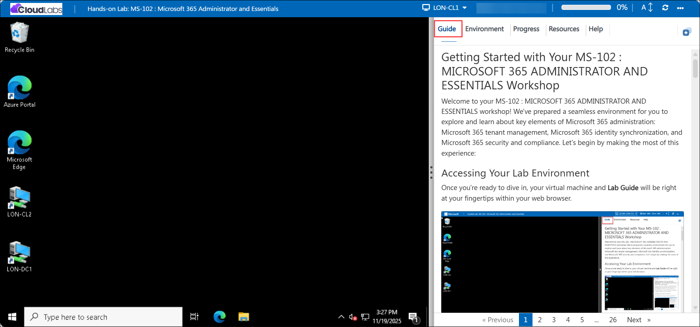 

### Virtual Machine & Lab Guide
 
Your virtual machine is your workhorse throughout the workshop. The lab guide is your roadmap to success.
 
## Exploring Your Lab Resources
 
To get a better understanding of your lab resources and credentials, navigate to the **Environment** tab.
 

## Utilizing the Split Window Feature
 
For convenience, you can open the lab guide in a separate window by selecting the **Split Window** button from the Top right corner.
 

 
## Managing Your Virtual Machine
 
1. Feel free to **Start, Stop, or Restart** your virtual machine as needed from the **Resources (1)** tab. Your experience is in your hands!

    - Once you finish using the lab for the day, please **stop or deallocate** the VM from the Resources tab as shown in the image below.

    - **Label (2)** indicates your **maximum uptime limit** and **remaining uptime**.

    - **Label (3)** indicates **Starting the VM**, and **label (4)** indicates **stopping or deallocating** it. All VMs can be stopped and start from resources tab. Stopping or deallocating the VMs helps preserve the VM uptime limit so you can continue working the next day without exhausting the available uptime.

    - **Label (5)** and **Label (6)** indicates child VMs control to stop and start.

        .png)

    - Please note that once the lab is launched, the overall lab session cannot be paused and will continue to run until the allotted time is fully consumed. Only the VM itself can be stopped or deallocated as described above.
 
      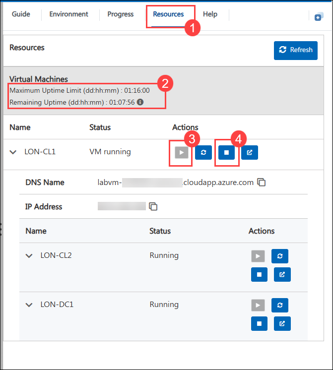

2. **NOTE:** If any virtual machine remains idle for approximately **30 minutes**, a **warning pop-up window** will appear (as shown in below image) indicating that the machine will shut down in **10 minutes** unless the warning is *cancelled*.

    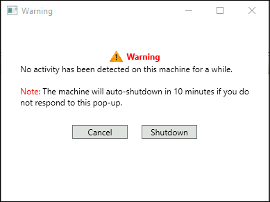

2. To initiate the required VMs, use the dropdown menu located at the top of the lab environment

    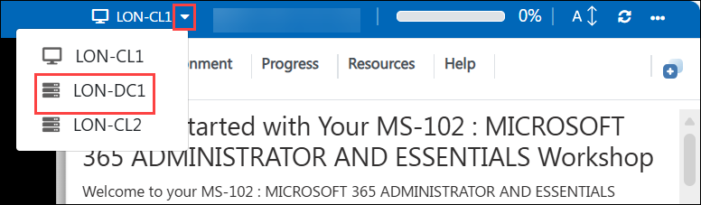

    > **NOTE:** If the drop-down to switch between virtual machines is not visible, connect to the **LON-CL1 VM**, and then select the required virtual machine from there to log in.
    >
    > 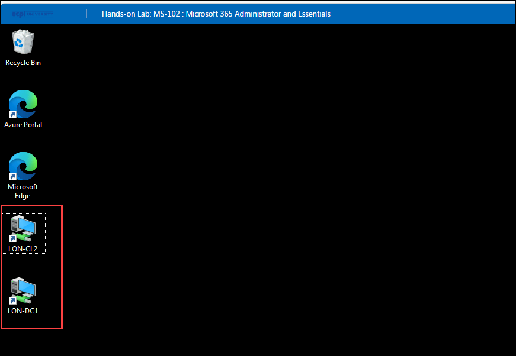
 
3. When logging into the Hyper-V virtual machines, if a message appears stating **"Press Ctrl+Alt+Delete to unlock"**, navigate to the **Actions** menu in the Virtual Machine Connection window and select the **Ctrl+Alt+Delete** option, as shown in the image below.

    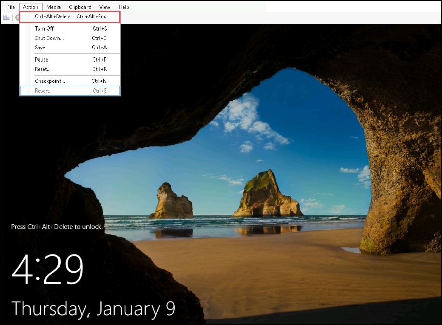

4. If you face an issue while copying the content from the lab guide and pasting it into the Hyper-V virtual machines, navigate to the **Clipboard** option in the Virtual Machine Connection window and select **Type Clipboard Text**.

    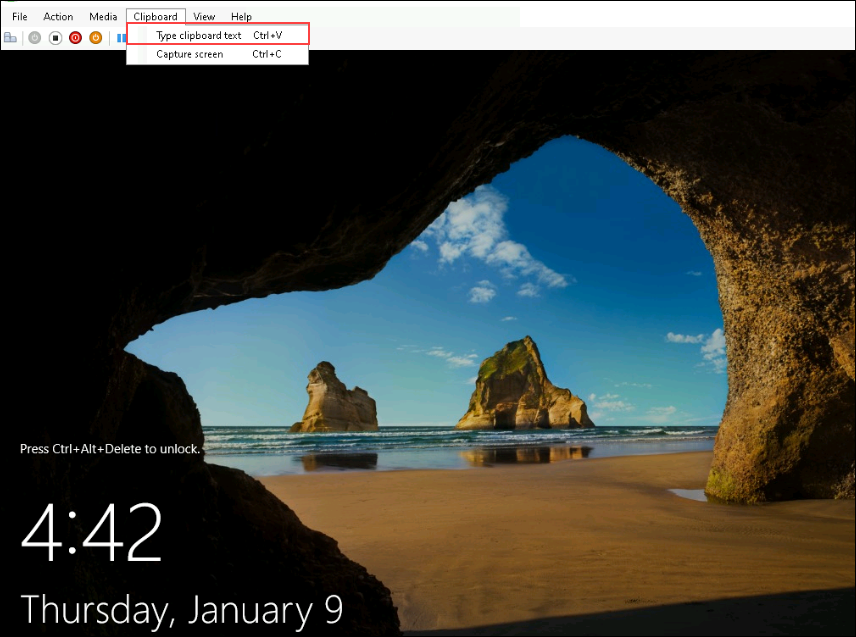  

## Lab Guide Zoom In/Zoom Out
 
To adjust the zoom level for the environment page, click the **A↕ : 100%** icon located next to the timer in the lab environment.

   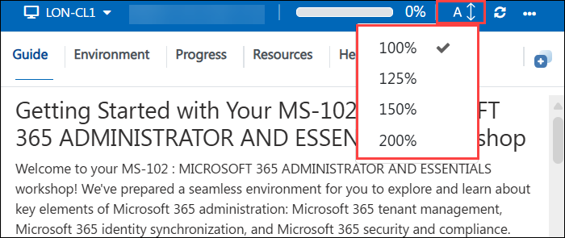

## Pasting Commands in the PowerShell/CloudShell Environment

Please make sure to use the **CTRL+SHIFT+V** or **CTRL+V** keys when pasting commands inside the PowerShell/CloudShell environment instead of right-clicking

## Let's Get Started with Azure Portal
 
1. On your virtual machine, click on the Azure Portal icon as shown below:
 
    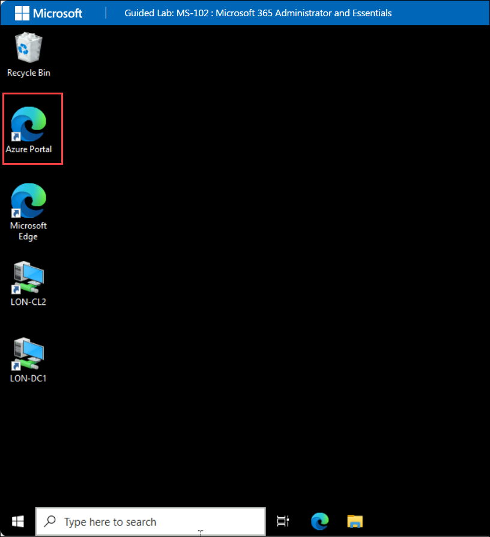

2. You'll see the **Sign into Microsoft Azure** tab. Here, enter your credentials:
 
   - **Email/Username:** <inject key="AzureAdUserEmail"></inject>
 
        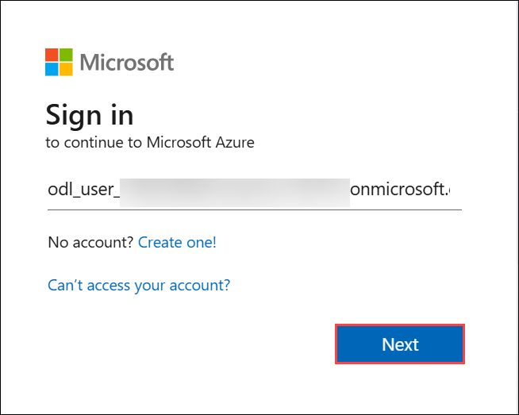
 
3. Next, provide your password:
 
   - **Password:** <inject key="AzureAdUserPassword"></inject>
 
        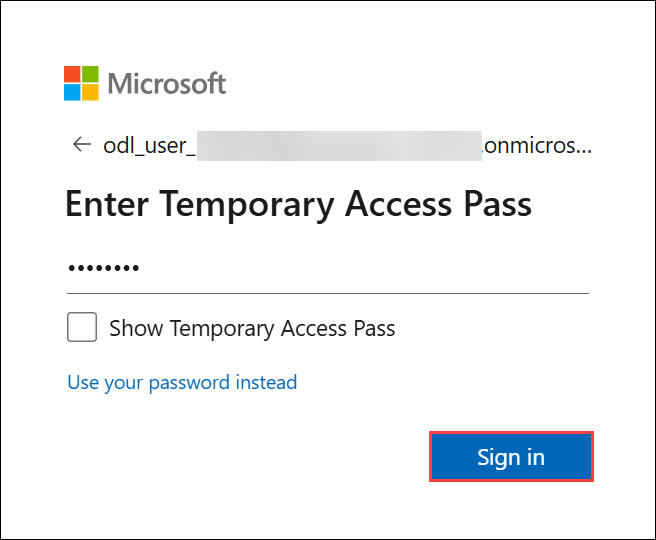

1. If prompted to **Stay signed in**, you can click **No.**
 
    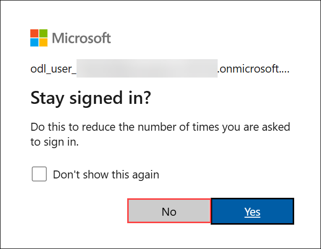

1. If a **Welcome to Microsoft Azure** pop-up window appears, simply click **Maybe Later** to skip the tour.

    

## Support Contact
 
The CloudLabs support team is available 24/7, 365 days a year, via email and live chat to ensure seamless assistance at any time. We offer dedicated support channels tailored specifically for both learners and instructors, ensuring that all your needs are promptly and efficiently addressed.

Learner Support Contacts:
- Email Support: cloudlabs-support@spektrasystems.com
- Live Chat Support: https://cloudlabs.ai/labs-support

- Now, click on **Next** from the lower right corner to move on to the next page.

    
 
Now you're all set to explore the powerful world of technology. Feel free to reach out if you have any questions along the way. Enjoy your workshop!

## Happy Learning!!